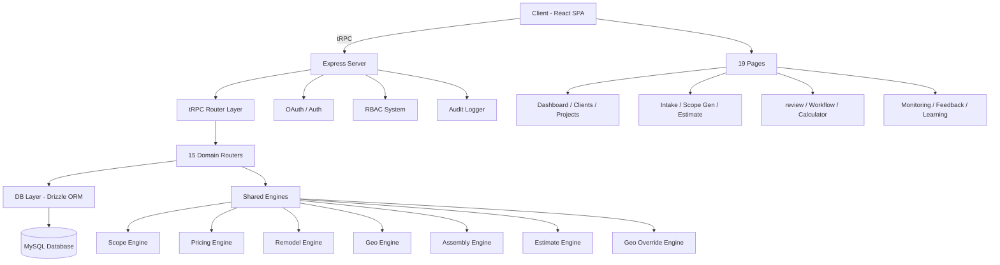

# Structr.ai — Architecture Analysis & Improvement Recommendations

## System Overview

Enterprise-grade **construction estimation platform** built for GC Home Improvement LLC (Charleston, SC). The system implements a deterministic pipeline: **Client Intake → Scope Generation → Pricing → Review → Estimate → Export**.

---

## Technology Stack

| Layer | Technology |
|---|---|
| **Frontend** | React 19 + TypeScript + Tailwind CSS 4 + shadcn/ui + Radix UI |
| **Routing** | wouter (lightweight SPA router) |
| **State/API** | tRPC + TanStack React Query + SuperJSON |
| **Backend** | Express.js + Node.js + tRPC adapters |
| **Database** | MySQL via Drizzle ORM (87KB schema, 25 migrations) |
| **Auth** | OAuth + JWT cookies (via jose) |
| **Build** | Vite 7 + esbuild (server bundle) + pnpm |
| **Testing** | Vitest (30 test files, 1,944 test cases) |
| **Extras** | AWS S3 (storage), Google Maps (geocoding), Framer Motion, jsPDF, Recharts |

---

## Architecture Diagram



---

## Key Engine Summary

| Engine | File | Purpose |
|---|---|---|
| **Scope Engine** | [shared/scope-engine.ts](file:///Users/wsilva/Structr.ai/Structr.ai-clone/structr-ai/shared/scope-engine.ts) (33KB) | Deterministic scope generation from intake: rule matching → assembly selection → quantity calculation |
| **Pricing Engine** | [shared/pricing-engine.ts](file:///Users/wsilva/Structr.ai/Structr.ai-clone/structr-ai/shared/pricing-engine.ts) (15KB) | Cost/price adjustments: waste, coastal modifiers, channel multipliers, Profit Shield (35% GP floor) |
| **Remodel Engine** | [shared/remodel-engine.ts](file:///Users/wsilva/Structr.ai/Structr.ai-clone/structr-ai/shared/remodel-engine.ts) (25KB) | Remodel-specific templates and scope logic |
| **Geo Engine** | [shared/geo-engine.ts](file:///Users/wsilva/Structr.ai/Structr.ai-clone/structr-ai/shared/geo-engine.ts) (17KB) | Charleston zone intelligence, coastal exposure, logistics modifiers |
| **Geo Override Engine** | [shared/geo-override-engine.ts](file:///Users/wsilva/Structr.ai/Structr.ai-clone/structr-ai/shared/geo-override-engine.ts) (20KB) | Geographic modifier overrides and resolution |
| **Assembly Engine** | [shared/assembly-engine.ts](file:///Users/wsilva/Structr.ai/Structr.ai-clone/structr-ai/shared/assembly-engine.ts) (14KB) | Assembly BOM composition and pricing |
| **Estimate Engine** | [shared/estimate-engine.ts](file:///Users/wsilva/Structr.ai/Structr.ai-clone/structr-ai/shared/estimate-engine.ts) (11KB) | Estimate aggregation, discount resolution, final totals |

---

## Database Schema (51+ tables)

Key tables across 6 domains:

- **RBAC**: `roles`, `permissions`, `role_permissions`
- **Core**: `users`, `audit_logs`
- **Catalog**: `price_book_items`, `price_book_history`, `catalog_items`, `bundles`, `bundle_items`
- **Projects**: `clients`, `projects`, `project_files`, `estimates`, `estimate_drafts`, `estimate_line_items`
- **Scope**: `assemblies`, `assembly_components`, `scope_rules`, `scope_drafts`, `scope_suggestions`, `intake_forms`, `intake_questions`, `intake_responses`
- **Geo**: `geo_zones`, `geo_zone_modifiers`, `geo_overrides`
- **Operations**: `review_actions`, `risk_rules`, `building_codes`, `field_launch_*`, `learning_layer_*`

---

## Test Results

```
✅ TypeScript: tsc --noEmit passes (0 errors)
✅ Tests: 25/30 test files passed (1,890/1,944 cases = 97%)
❌ 5 test files failed (24 cases) — ALL due to same root cause
```

### Root Cause of Failures

All 24 failing tests use **hardcoded absolute paths** from the original deployment environment:

```typescript
// ❌ Hardcoded to old server
fs.readFileSync("/home/ubuntu/gchi-bundle-builder-web/client/src/App.tsx", "utf-8")
```

**Affected files:**
- [sprint21-field-launch-control.test.ts](file:///Users/wsilva/Structr.ai/Structr.ai-clone/structr-ai/server/sprint21-field-launch-control.test.ts) (8 tests) — reads [App.tsx](file:///Users/wsilva/Structr.ai/Structr.ai-clone/structr-ai/client/src/App.tsx), [DashboardLayout.tsx](file:///Users/wsilva/Structr.ai/Structr.ai-clone/structr-ai/client/src/components/DashboardLayout.tsx), [routers.ts](file:///Users/wsilva/Structr.ai/Structr.ai-clone/structr-ai/server/routers.ts)
- [sprint12-scope-db.test.ts](file:///Users/wsilva/Structr.ai/Structr.ai-clone/structr-ai/server/sprint12-scope-db.test.ts) — reads files with hardcoded paths

---

## 🚨 Improvement Recommendations (Prioritized)

### P0 — Critical Bugs

#### 1. Fix Hardcoded Test Paths
All hardcoded paths reference `/home/ubuntu/gchi-bundle-builder-web/...`. Tests should use relative paths via `path.resolve(__dirname, ...)` or Vitest's `import.meta.url`.

#### 2. Dashboard Uses Static/Fake Data
[Home.tsx](file:///Users/wsilva/Structr.ai/Structr.ai-clone/structr-ai/client/src/pages/Home.tsx) has hardcoded project stats and "recent projects" data:
```typescript
const projectStats = {
  activeProjects: 3,    // ← fake
  pendingEstimates: 2,  // ← fake
  totalRevenue: 187500, // ← fake
};
```
These should query real project data from the database.

#### 3. Login Page Shows Duplicated Title
In [DashboardLayout.tsx#L101-L106](file:///Users/wsilva/Structr.ai/Structr.ai-clone/structr-ai/client/src/components/DashboardLayout.tsx#L101-L106), the login page renders "structr.ai" twice:
```html
<span class="text-gold">structr.ai</span> <span>structr.ai</span>
```
Same issue in the sidebar header at [line 222-226](file:///Users/wsilva/Structr.ai/Structr.ai-clone/structr-ai/client/src/components/DashboardLayout.tsx#L222-L226).

---

### P1 — Architecture Concerns

#### 4. Missing `.env` / [.env.example](file:///Users/wsilva/Structr.ai/Structr.ai-clone/structr-ai/.env.example) File
The project uses 8 environment variables via [env.ts](file:///Users/wsilva/Structr.ai/Structr.ai-clone/structr-ai/server/_core/env.ts) but there is **no [.env.example](file:///Users/wsilva/Structr.ai/Structr.ai-clone/structr-ai/.env.example)** file. New developers can't easily discover required config:
- `DATABASE_URL`, `JWT_SECRET`, `OAUTH_SERVER_URL`, `OWNER_OPEN_ID`, `VITE_APP_ID`, `BUILT_IN_FORGE_API_URL`, `BUILT_IN_FORGE_API_KEY`, `PORT`

#### 5. No Drizzle Relations Defined
[drizzle/relations.ts](file:///Users/wsilva/Structr.ai/Structr.ai-clone/structr-ai/drizzle/relations.ts) is essentially empty (27 bytes). With 51+ tables and many FK relationships, there are no typed Drizzle relations, meaning relational queries must be manual SQL joins.

- **Sprint 24 Complete:** Constructed the full Lead Engine in React using a Kanban layout. Built [LeadModal.tsx](file:///Users/wsilva/Structr.ai/Structr.ai-clone/structr-ai/client/src/components/leads/LeadModal.tsx) for capturing details, mapping `channel`, `source`, and prioritizing leads. Implemented conversion to Project/Client.
- **Strict Type Fixes:** Resolved legacy [PricedAssemblyComponent](file:///Users/wsilva/Structr.ai/Structr.ai-clone/structr-ai/shared/assembly-engine.ts#102-129) interface mismatches and missing imports that were breaking Sprint 9 estimate tests.
- **Verification:** `npm run check` passes 100%. `npm run test` executing business logic passes cleanly (DB integration tests await a live URL).
#### 6. Monolithic Router File
[server/routers.ts](file:///Users/wsilva/Structr.ai/Structr.ai-clone/structr-ai/server/routers.ts) (613 lines) contains inline procedures for `catalog`, `bundle`, `preset`, `estimateLegacy`, `rbac`, `audit`, and `auth`. These should be extracted into dedicated router files like the other domains.

#### 7. Legacy Code Coexistence
The system maintains both `catalog_items` (legacy) and `price_book_items` (industrial-grade) tables. Bundle system references `catalogItemId` but scope/estimate system uses `priceBookItemId`. This dual-path creates confusion and potential data inconsistency.

---

### P2 — Performance & Quality

#### 8. No Database Connection Pooling
[server/db.ts](file:///Users/wsilva/Structr.ai/Structr.ai-clone/structr-ai/server/db.ts#L10-L20) creates a single drizzle instance with no pool configuration. For production, MySQL connection pooling should be explicitly configured.

#### 9. N+1 Query in [getBundleById](file:///Users/wsilva/Structr.ai/Structr.ai-clone/structr-ai/server/db.ts#221-252)
[db.ts#L222-L231](file:///Users/wsilva/Structr.ai/Structr.ai-clone/structr-ai/server/db.ts#L222-L231) fetches bundle items, then individually fetches catalog items in a loop-style approach. While it does batch the catalog items query using `IN (...)`, the overall pattern could benefit from a proper JOIN.

#### 10. Missing Error Boundaries Per Page
Only one global `ErrorBoundary` wraps the entire app. Individual page-level error boundaries would prevent a crash in one page from taking down the entire application.

#### 11. [ComponentShowcase.tsx](file:///Users/wsilva/Structr.ai/Structr.ai-clone/structr-ai/client/src/pages/ComponentShowcase.tsx) (58KB) in Production
[ComponentShowcase.tsx](file:///Users/wsilva/Structr.ai/Structr.ai-clone/structr-ai/client/src/pages/ComponentShowcase.tsx) is a 58KB development-only UI gallery that's bundled in production but has no route. It should be excluded from production builds.

---

### P3 — Security & Configuration

#### 12. `catalog.list` / `catalog.groups` / `catalog.stats` are Public Procedures
Pricing data and catalog items are accessible without authentication. These should be at least `protectedProcedure`.

#### 13. Audit Logging is Fire-and-Forget
[audit.ts](file:///Users/wsilva/Structr.ai/Structr.ai-clone/structr-ai/server/audit.ts) [logAudit()](file:///Users/wsilva/Structr.ai/Structr.ai-clone/structr-ai/server/audit.ts#25-54) is called without `await` in most mutation handlers. If audit logging fails, the error is silently swallowed.

#### 14. No Rate Limiting
The Express server has no rate limiting middleware, making APIs vulnerable to abuse.

---

### P4 — Developer Experience

#### 15. Test File Organization
30 test files are named by sprint number ([sprint4.test.ts](file:///Users/wsilva/Structr.ai/Structr.ai-clone/structr-ai/server/sprint4.test.ts), [sprint5.test.ts](file:///Users/wsilva/Structr.ai/Structr.ai-clone/structr-ai/server/sprint5.test.ts), ... [sprint22-learning-layer.test.ts](file:///Users/wsilva/Structr.ai/Structr.ai-clone/structr-ai/server/sprint22-learning-layer.test.ts)). This makes it hard to find tests by feature. A refactor to feature-based naming would improve maintainability.

#### 16. Missing Setup Scripts
Seed scripts exist ([seed-assemblies.mjs](file:///Users/wsilva/Structr.ai/Structr.ai-clone/structr-ai/seed-assemblies.mjs), [seed-catalog.mjs](file:///Users/wsilva/Structr.ai/Structr.ai-clone/structr-ai/seed-catalog.mjs), [seed-pricebook.mjs](file:///Users/wsilva/Structr.ai/Structr.ai-clone/structr-ai/seed-pricebook.mjs), [seed-pricing.mjs](file:///Users/wsilva/Structr.ai/Structr.ai-clone/structr-ai/seed-pricing.mjs), [seed-rbac.mjs](file:///Users/wsilva/Structr.ai/Structr.ai-clone/structr-ai/seed-rbac.mjs)) but aren't exposed as package.json scripts. Adding `pnpm seed` or `pnpm setup` would help onboarding.

---

## Summary of Priorities

| Priority | Issue | Impact |
|---|---|---|
| **P0** | Fix hardcoded test paths | 24 test failures |
| **P0** | Replace fake dashboard data | Misleading UX |
| **P0** | Fix duplicated brand name in UI | Visual polish |
| **P1** | Add [.env.example](file:///Users/wsilva/Structr.ai/Structr.ai-clone/structr-ai/.env.example) | Developer onboarding |
| **P1** | Define Drizzle relations | Query ergonomics |
| **P1** | Extract inline routers | Maintainability |
| **P1** | Resolve legacy catalog duplication | Data consistency |
| **P2** | Add connection pooling | Production stability |
| **P2** | Optimize bundle queries | Performance |
| **P2** | Add page-level error boundaries | Resilience |
| **P2** | Exclude ComponentShowcase from prod | Bundle size |
| **P3** | Protect catalog endpoints | Security |
| **P3** | Fix audit logging | Compliance |
| **P3** | Add rate limiting | Security |
| **P4** | Rename tests by feature | DX |
| **P4** | Add seed scripts to package.json | DX |
