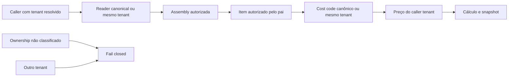

# G4b — Catalog Ownership Architecture

## 1. Estado, autoridade e limite deste documento

- **Data:** 2026-09-17.
- **Classificação Superpowers:** arquitetural.
- **Base local observada:** `719fc4d9872571748a254a0a9037f12e97cc96a6`, branch `codex/g2-override-logs-20260915`, árvore limpa antes desta edição.
- **Direção humana aprovada:** substituir o G4a inviável por um G4b completo; catálogo canônico inicialmente vazio; classificação humana dos dados existentes; preço-base e calibração ligados ao catálogo sempre isolados por tenant.
- **Estado deste artefato:** direção arquitetural aprovada; rascunho escrito consolidado, ainda pendente de PASS independente e aprovação humana do texto.
- **Autoridade:** `AGENTS.md`; Canonical Structr Product & Engineering Truth v1 publicado na `main` `8fa14da3e9c275645c0f7b4fd67dcc5a3ebc6dcf`; ADR-001; Controlled Engineering Workflow; registros de segurança vinculados aos seus SHAs.

Este documento autoriza somente o desenho. Ele **não** autoriza plano de implementação, RED, código, migration, classificação de linha viva, backfill, seed, Supabase, RLS, Data API, commit de implementação, push, alteração da PR #9, merge, deploy ou campo.

O estado externo foi reconfirmado em leitura antes deste desenho:

- PR #9 aberta, não mesclada, merge gate `NO-GO`, head remoto `b95ea0bf4741646f418fcc99a22d22a42d24be51`;
- projeto Supabase `structr-ai` (`xoqhxpqsfxpdiwyuvhdd`) `ACTIVE_HEALTHY`;
- Data API permanece desativada conforme o estado operacional previamente registrado;
- inventário administrativo continua reportando 60 tabelas públicas com RLS desativado;
- `assemblies`, `assembly_items`, `cost_codes` e `cost_code_pricing_history` foram observadas com RLS ativado, mas política, grants, papel efetivo da aplicação e `BYPASSRLS` não foram provados.

Nenhum fato acima concede prontidão operacional ou segurança global.

## 2. Problema que o G4b resolve

A ADR classifica assemblies como HYBRID:

1. templates `platform_canonical`, curados pela plataforma e somente leitura para tenants;
2. assemblies `tenant_owned`, criadas ou clonadas e administradas por um tenant.

O G4a antigo tentaria expor apenas `tenant_id IS NULL`, usando NULL somente como exclusão transitória. A inspeção viva mostrou que esse desenho atingiu a própria cláusula de bloqueio:

| Conjunto | Total | `tenant_id IS NULL` | Tenant-stamped |
|---|---:|---:|---:|
| `assemblies` | 15 | 0 | 15 |
| `cost_codes` | 460 | 0 | 460 |
| `assembly_items` | 117 | n/a | 117 vínculos válidos |

O censo complementar, também somente agregado, observou:

- 598 linhas em `cost_code_pricing_history`, todas ligadas a cost codes stamped e nenhuma órfã;
- 426 linhas de preço ativas e zero cost code com mais de uma linha ativa;
- um único tenant distinto entre os pais desses históricos;
- zero `unit_cost_override` entre os 117 assembly items;
- 7 cost types e 22 units, cuja ownership não foi classificada.

Há um tenant distinto em cada conjunto, zero referências ausentes e zero divergências de tenant entre os 117 vínculos. Isso prova consistência estrutural atual, não proveniência. A migration `drizzle/0001_phase1_identity_tenant.sql` possui um backfill que atribui indiscriminadamente o tenant padrão a linhas sem tenant, inclusive `assemblies` e `cost_codes`. Portanto, o stamp não prova se uma linha é canônica ou tenant-owned.

Aplicar literalmente o G4a deixaria o catálogo vazio e interromperia Calculator, Scope, Estimate e seus consumidores. Expor as linhas stamped globalmente violaria a ADR. Limpar os stamps, promover o tenant observado a plataforma ou declarar os registros canônicos por contagem/semelhança também violaria a ADR.

O escopo anterior mencionava explicitamente apenas um marcador canônico em assemblies. A medição atual demonstrou que isso é insuficiente:

- `assembly_items` aponta diretamente para `cost_codes`;
- `cost_code_pricing_history` herda autoridade apenas do pai;
- `cost_codes` contém feedback comercial por tenant (`lastAdjustment*`, `calibrationSampleCount` e integração JobTread);
- writers de bundle, actuals, pricing, calibration e price adjustment aceitam referências ou alteram estado desse grafo;
- o cache do cliente sobrevive à troca de identidade.

Assim, G4b é ampliado de forma explícita para o **grafo de ownership do catálogo**, sem absorver G3b, a remediação global de RLS ou a PR #9.

### 2.1 Reconciliação formal G4a → G4b

O workflow publicado em `f60cf9a56679d4d7083b2c11ac4e2727d53d84c3` exige STOP quando o Recover encontra fato vivo que invalida o escopo. O current-state documental local `e6570c408764b1fd63fbfe2937a46a8f53189ec0`, baseado exatamente nesse workflow, ainda apontava G4a como a próxima unidade porque foi escrito antes do censo atual.

Este Recover aciona a cláusula de bloqueio já prevista pela ADR e pelo plano histórico:

- **G4a = NO-GO / superseded para implementação**; não há RED ou patch G4a a executar;
- G4b permanece fora do diff e da carta original da PR #9;
- como G4a não consegue fechar a superfície de catálogo, um resultado G4b integrado à futura base final passa a ser pré-requisito para qualquer nova avaliação de global-B2/merge;
- este documento não decide em qual branch/PR G4b será publicado ou integrado;
- depois do gate documental deste desenho, a linhagem do workflow substitui `docs/engineering/current-state.md` pelo estado corrente e acrescenta uma entrada append-only em `docs/engineering/decision-correction-log.md`, sem copiar ou reescrever documentos da linhagem de segurança.

Até essa atualização, o fato mais novo e mais específico deste Recover governa a transição: G4a não inicia e G4b segue apenas em Design.

## 3. Objetivos e não objetivos

### 3.1 Objetivos

1. Tornar ownership explícito e verificável para assemblies e cost codes.
2. Implementar a visibilidade exata `platform_canonical ∪ caller tenant`.
3. Preservar preço, calibração, integração e feedback como estado tenant-owned.
4. Impedir referências cross-tenant em toda a BOM e nos writers dependentes.
5. Permitir clone canônico → tenant como cópia independente e transacional.
6. Classificar legado somente por evidência ou decisão humana auditada.
7. Impedir que cache ou resposta tardia atravesse uma troca de identidade.
8. Manter Calculator, Scope e Estimate funcionais para dados corretamente classificados.

### 3.2 Não objetivos

- inferir ownership pelos stamps atuais, por NULL, por região, por nomes, por contagem ou por um seed parecido;
- declarar qualquer uma das 15 assemblies ou 460 cost codes como canônica neste documento;
- criar billing, entitlement ou plano comercial;
- criar G3b ou alterar política geo;
- recalcular estimates históricos ou reescrever snapshots/exportações existentes;
- criar edição canônica para tenant admin;
- reativar Data API ou modificar RLS/grants/policies sem plano próprio;
- promover status no registro canônico de capacidades;
- emitir GO para PR #9, segurança global, produção ou campo.

### 3.3 Claim candidato estreito

Quando todas as subunidades e gates deste programa estiverem fechados no mesmo estado integrado, G4b poderá alegar somente:

> Para o grafo de catálogo classificado, um caller autenticado com tenant resolvido lê definições canônicas ativas e registros do próprio tenant; tenant admins modificam somente registros do próprio tenant; arestas operacionais não cruzam tenants; preço-base, mappings externos e feedback do catálogo pertencem ao tenant; e uma troca de identidade não reutiliza cache de negócio da identidade anterior.

O claim não inclui multiplicadores regionais/channel/finish, modelos paramétricos, política geo, toda a precificação do produto, toda a proveniência do repositório, todas as tabelas RLS, operação em campo ou segurança global. Esses limites permanecem mesmo que os testes G4b estejam verdes.

## 4. Alternativas consideradas

| Alternativa | Descrição | Vantagem | Custo/risco | Disposição |
|---|---|---|---|---|
| **A — discriminator explícito + estado comercial por tenant** | Mantém as tabelas principais e seus IDs; adiciona ownership explícito; separa preço, calibração e integração por tenant | Menor reescrita do caminho de receita; migração aditiva; preserva FKs e snapshots | Exige constraints de aresta e classificação auditada | **Selecionada** |
| **B — namespace genérico de owners** | Nova entidade de ownership representa plataforma e tenants | Muito extensível | Novo subsistema, joins e onboarding desnecessários para o piloto | Rejeitada por complexidade sem benefício atual |
| **C — tabelas físicas separadas** | Tabelas distintas para canonical e tenant, unidas por views | Isolamento físico forte | Reescreve FKs, routers e consumidores críticos; maior risco de migração | Rejeitada para este ciclo |

Uma contenção tenant-only sem arquitetura canônica poderia manter o piloto atual, mas preservaria um estado diferente do end state aprovado pela ADR e exigiria nova reescrita. Ela não é substituta do G4b.

## 5. Modelo de ownership

### 5.1 Taxonomia

`shared/domain/taxonomy.ts` será a fonte canônica de `CatalogOwnershipKind`:

- `unclassified` — quarentena explícita; nunca visível nem gravável por operação comercial;
- `platform_canonical` — definição curada pela plataforma, `tenant_id IS NULL`;
- `tenant_owned` — registro pertencente a exatamente um tenant, `tenant_id IS NOT NULL`.

`unclassified` é estado de migração/proveniência, não uma terceira forma válida de uso comercial. Novos writers normais nunca o produzem.

A mesma fonte define `CatalogOwnershipOrigin`:

- `legacy_classification` — linha preexistente classificada por manifesto humano;
- `platform_curated` — nova revisão canônica produzida por curadoria futura;
- `tenant_runtime` — linha tenant-owned criada normalmente por um caller tenant autorizado.

`ownership_origin` é write-once. Ele pode transitar de NULL para `legacy_classification` somente na primeira decisão executada pelo papel classificador. Depois de não nulo, é imutável. Uma linha `tenant_runtime` ou `platform_curated` incorreta é aposentada e substituída; nunca muda de origem nem é convertida in-place. Uma linha legacy pode receber nova decisão de quarentena sem perder sua origem.

As constraints permanentes aceitam **somente** as cinco tuplas completas abaixo; qualquer outra combinação é recusada por `CHECK`, além dos triggers de vínculo:

```text
unclassified inicial                => origin NULL, decision NULL,
                                       campos canônicos NULL; tenant stamp pode existir, mas é inerte
unclassified legacy em quarentena   => origin legacy_classification,
                                       decision NOT NULL com decisão unclassified,
                                       campos canônicos NULL; tenant stamp é inerte
platform_canonical                  => origin platform_curated, tenant NULL,
                                       decision NOT NULL com decisão platform_canonical,
                                       canonical_key/version/status NOT NULL
tenant_owned legacy                 => origin legacy_classification, tenant NOT NULL,
                                       decision NOT NULL com decisão tenant_owned,
                                       campos canônicos NULL
tenant_owned runtime                => origin tenant_runtime, tenant NOT NULL,
                                       decision NULL, created_by NOT NULL,
                                       campos canônicos NULL
```

As duas tuplas `unclassified` são inacessíveis à aplicação de negócio. A decisão `unclassified` revoga uso comercial de uma classificação legacy sem apagar sua cadeia. `tenant_id` sozinho nunca decide ownership.

### 5.2 Ledger de classificação

Serão criadas três estruturas append-only:

#### `catalog_classification_batches`

- `id`;
- SHA da aplicação e fingerprint do schema;
- fingerprint do snapshot/manifesto;
- fingerprint esperado do pós-estado completo;
- contagens esperadas por tabela e decisão;
- autor e timestamp de preparação.

A linha do batch é um descritor imutável; ela não carrega estado mutável.

#### `catalog_classification_batch_events`

- `id`, `batch_id` e sequência monotônica;
- evento `prepared | approved | applied | superseded | failed`;
- ator, timestamp, resultado e motivo;
- hash encadeado do evento anterior;
- nenhuma informação comercial em log geral.

O estado do batch é derivado da sequência válida de eventos. Transições inválidas são recusadas por constraint/trigger e não sobrescrevem eventos anteriores.

#### `catalog_ownership_decisions`

- `id`;
- batch;
- tabela e ID da entidade;
- decisão `unclassified | platform_canonical | tenant_owned`;
- tenant quando aplicável;
- fingerprint anterior da linha;
- fingerprint esperado da linha depois da decisão;
- tipo, hash e referência da evidência;
- justificativa;
- decisor, revisor e timestamps;
- `supersedes_decision_id`, quando houver.

Decisões não são apagadas ou atualizadas. Correções criam uma nova decisão que aponta para a anterior. Cada entidade com origem `legacy_classification` ou `platform_curated` aponta para sua decisão ativa por `ownership_decision_id`. Linhas `tenant_runtime` provam origem por tenant confiável, ator e audit transacional; elas não fingem possuir uma decisão humana.

Registros legados auxiliares que não são entidades de catálogo usam `g4b_legacy_contract_decisions`, ledger append-only ligado ao batch. Cada decisão contém tabela, row ID, scope/origin aprovado, tenant/source/project esperados quando conhecidos, fingerprints anterior e posterior, evidência, decisor e revisor. Constraint triggers em `field_feedback_reports`, `jobtread_exports` e na metadata de classificação de `audit_log` exigem que o decision ID referencie exatamente a própria linha, que a tupla final coincida com a decisão e que o batch aplicado tenha os hashes esperados. O ledger não recebe grants web e não inventa owner ausente.

Uma FK simples ao ledger não basta para provar que a decisão pertence à linha. Um constraint trigger `DEFERRABLE INITIALLY DEFERRED` em `assemblies`, `cost_codes`, `cost_types` e `units` verifica, no commit de insert/reclassificação com origem classificada/curada, que:

1. a decisão referencia exatamente a tabela e o ID da própria entidade;
2. o batch possui evento `approved` e a aplicação produz o evento `applied` na mesma transação;
3. `ownership_kind` e `tenant_id` coincidem exatamente com a decisão;
4. existe uma única decisão ativa por entidade e a cadeia de supersession parte da decisão antes ativa;
5. o fingerprint anterior ainda coincide;
6. depois de aplicar classificação, estados e constraints, o banco recalcula o fingerprint pós-estado de cada linha e do batch completo e os compara aos valores aprovados;
7. somente depois dessa igualdade exata a transação insere o evento `applied`, incluindo o hash pós-estado observado;
8. entidade, decisão ativa, batch event e audit durável são gravados no mesmo transaction handle.

Papéis comerciais não recebem `UPDATE` sobre `ownership_kind`, `ownership_origin`, `tenant_id` ou `ownership_decision_id`. Apenas um papel classificador de plataforma, ausente dos routers de negócio, pode executar a transição inicial NULL→`legacy_classification`, classificação, correção ou quarentena. Create tenant normal recebe `tenant_id`, `ownership_kind='tenant_owned'`, `ownership_origin='tenant_runtime'` e `created_by` exclusivamente do contexto autenticado, com audit no mesmo transaction handle. Correção de linha legacy cria decisão supersessora; ela pode restaurar a tupla `unclassified legacy em quarentena`, mas nunca apaga a decisão anterior. Correção bloqueia a entidade e revalida todas as referências inbound: uma aresta O incompatível precisa ser corrigida/quarentenada na mesma operação ou a reclassificação é recusada; um snapshot S nunca é reescrito e sua existência não concede visibilidade atual ao alvo. Se uma FK histórica obrigatória não puder ser preservada sem violar esse contrato, a reclassificação é recusada e uma nova entidade deve ser criada.

Evidência aceitável: correspondência integral de ID e hash com origem confiável; cadeia de importação verificável; atestação humana explícita e auditada; ou conteúdo canônico novo e deliberadamente curado.

Não são evidência suficiente: stamp de tenant, NULL, quantidade de linhas, único tenant existente, nome/categoria/região, semelhança parcial com CSV, execução presumida de seed ou papel `admin`.

### 5.3 Estado inicial

- O conjunto `platform_canonical` começa vazio.
- As 15 assemblies, 117 items, 460 cost codes, 7 cost types e 22 units atuais começam `unclassified`, com origem/decisão NULL, no manifesto.
- Linhas necessárias ao piloto só se tornam `tenant_owned` depois de comparação integral e aprovação humana.
- Nenhuma linha histórica é promovida a `platform_canonical`.
- Novos templates canônicos recebem novos IDs, decisão de curadoria e conteúdo revisado.

## 6. Modelo físico aprovado

### 6.1 `assemblies`

Adicionar:

- `ownership_kind`;
- `ownership_origin` e `created_by`;
- `ownership_decision_id`;
- `canonical_key` e `catalog_version` para revisões canônicas imutáveis;
- `canonical_status = active | retired`;
- `source_assembly_id`, `source_ownership_kind`, `source_catalog_version` e `source_digest` para proveniência tipada de clones tenant-owned.

Regras:

- assembly canônica não contém preço, custo, `unitCostOverride` ou política comercial específica de tenant;
- `coastal_modifier` não entra em template canônico sem classificação explícita de sua semântica;
- soft-delete/desativação mantém histórico e ownership;
- uma revisão canônica nunca é alterada in-place: `(canonical_key, catalog_version)` é único e existe no máximo uma revisão `active` por chave;
- nova revisão recebe nova linha/ID e a anterior passa a `retired` em transação auditada;
- clone não mantém vínculo mutável com a fonte; os campos `source_*` são proveniência, não herança dinâmica. `source_catalog_version` só é preenchido para fonte canônica; fonte tenant registra kind/ID/digest sem ser rotulada como canônica;
- `canonical_key` é reservado ao papel de curadoria e permanece NULL em linha tenant-owned; o mesmo índice/lock simétrico por `normalized_code` do §6.2 vale para assemblies: tenant recusa canonical ativo e futura curadoria recusa código usado por qualquer tenant. Clone exige `name` e `code` tenant-local distintos; G4b não implementa shadow/override implícito.

### 6.2 `cost_codes`

`cost_codes` passa a representar a definição semântica do código e recebe:

- `ownership_kind`;
- `ownership_origin` e `created_by`;
- `ownership_decision_id`;
- `canonical_key`, `catalog_version` e `canonical_status` com a mesma regra de revisão imutável das assemblies.

Uma definição canônica pode ser visível a tenants, mas não pode armazenar estado comercial específico de nenhum deles.

Os campos comerciais saem da linha compartilhável e são separados pela sua dimensionalidade:

- `tenant_cost_code_state (tenant_id, cost_code_id)` contém `jobtread_id`, `is_active`, ativação/mapping e timestamps;
- `tenant_cost_code_unit_state (tenant_id, cost_code_id, unit_id)` contém `is_active`, `pricing_head_id`, `pricing_timeline_version`, `last_adjustment_id`, `last_adjustment_pct`, `last_adjusted_at`, `calibration_sample_count` e timestamps.

Ambos possuem FKs para tenant/definições. O estado pode existir para um cost code canônico visível ou para um cost code do próprio tenant; a unit deve ser canônica ativa ou do mesmo tenant. `cost_code_pricing_history (tenant_id, cost_code_id, unit_id)` referencia o estado unitário existente. `last_adjustment_id` recebe FK para um adjustment da mesma chave tenant+code+unit. Constraints/triggers impedem estado sem definição visível ou mistura de unidades.

Colisão é proibida simetricamente: `canonical_key` é reservado ao papel de curadoria e permanece NULL em linha tenant-owned. Um índice parcial preserva unicidade de `code` normalizado entre canônicos ativos e outro preserva unicidade local `(tenant_id, normalized_code)` entre linhas tenant-owned. Toda criação, renomeação ou ativação adquire primeiro o advisory lock global derivado de `(catalog_kind, normalized_code)`. Tenant create/update recusa colisão com canônico ativo; canonical create/activate recusa colisão com **qualquer** tenant. Tenants distintos podem usar o mesmo código local, mas a serialização global impede que futura curadoria publique o mesmo código enquanto qualquer colisão existir. G4b não implementa precedência/shadow por texto em list, group, stats, JobTread, actuals, calibration ou exports.

### 6.3 `cost_types` e `units`

Ambas entram no mesmo modelo `unclassified | platform_canonical | tenant_owned`, com `ownership_origin`, `created_by`, ledger para origem classificada/curada, revisions canônicas imutáveis e visibilidade `canonical ∪ tenant`.

Definição neutra:

- `cost_types`: identidade/nome da classe;
- `units`: nome e abreviação da medida.

Estado tenant-owned:

- `tenant_cost_type_state (tenant_id, cost_type_id)`: `default_margin`, taxabilidade, time tracking, `jobtread_id` e `is_active` específico do tenant;
- `tenant_unit_state (tenant_id, unit_id)`: `jobtread_id` e `is_active` específico do tenant.

As referências obedecem:

| Referência | Regra |
|---|---|
| `assemblies.default_unit_id` | unit canônica ou do mesmo tenant da assembly |
| `cost_codes.default_cost_type_id` | cost type canônico ou do mesmo tenant do cost code |
| `cost_codes.default_unit_id` | unit canônica ou do mesmo tenant do cost code |
| `cost_code_pricing_history.unit_id` | unit canônica ou do mesmo tenant do preço; obrigatória |
| `assembly_items.cost_type_id/unit_id` | definição canônica ou do mesmo tenant do pai; compatível com cost code e preço |

Nenhum dos 7 cost types ou 22 units existentes vira canônico por inferência. Enquanto as definições exigidas não forem classificadas, o conjunto canônico permanece vazio e o cutover do grafo correspondente é bloqueado.

### 6.3.1 Lifecycle do estado tenant e campos legados

As quatro tabelas de estado possuem PK/unique pela chave tenant+definição, `created_by`, versão para CAS e timestamps. Mappings JobTread não vazios são únicos por tenant dentro de cada namespace. O lifecycle é explícito:

- a data operation cria estados iniciais somente a partir do manifesto aprovado; ausência de state significa inativa;
- create runtime de cost code, cost type ou unit grava definição tenant-owned e seu state `is_active=false` na mesma transação; cost type runtime nasce com `default_margin=NULL` e nunca ativa implicitamente;
- `catalog.state.configureCostCode`, `configureCostCodeUnit`, `configureCostType` e `configureUnit` são as únicas mutations de configuração, todas `adminTenantProcedure`, com CAS, readback e audit transacional; nenhum input aceita tenant;
- `catalog.state.get/list` são `tenantProcedure` e retornam por ID os motivos de inatividade, mapping ou preço ausente sem revelar linha foreign;
- ativar cost code exige definição visível e cost type/unit states ativos; ativar a série unitária pela primeira vez ocorre somente em `pricing.initializeCostCodeUnitPrice`, que cria o primeiro head/preço elegível sem sobreposição na mesma transação. Reativação posterior exige head íntegro e preço elegível;
- ativar cost type/unit exige definição visível. JobTread readiness exige adicionalmente mappings válidos, mas ausência de mapping não bloqueia cálculo local; desativar bloqueia imediatamente novos cálculos/exports sem reescrever snapshots;
- `configureCostType` não edita `default_margin`: no G4b esse valor é migration/classifier-only, e edição comercial de margem fica bloqueada para G4c. A mutation recusa `isActive=true` quando `default_margin IS NULL`; antes de G4c, somente state legacy com margem integralmente comprovada no manifesto pode ativar. Nenhum cálculo/export aceita margem NULL nem aplica default/fallback;
- os campos de last adjustment/calibration do state unitário são system-owned e só mudam na transação de adjustment/calibration, nunca por `configure*`.

Inputs normativos: `configureCostCode {costCodeId,isActive,jobtreadId,expectedVersion}`; `configureCostCodeUnit {costCodeId,unitId,isActive,expectedVersion}`; `configureCostType {costTypeId,isActive,jobtreadId,isTaxable,isTimeTrackable,expectedVersion}`; `configureUnit {unitId,isActive,jobtreadId,expectedVersion}`. Mapping pode ser NULL, mas então export readiness é false. `pricing.initializeCostCodeUnitPrice {costCodeId,unitId,unitCost,unitPrice}` só funciona quando state/head/history da chave ainda não existem; usa a evaluation date do servidor como effective date, cria head+version=1, ativa o state e audita no mesmo transaction handle. Qualquer alteração posterior passa por adjustment.

Os campos comerciais legados ficam congelados antes do manifesto: `cost_codes.jobtread_id/is_active/lastAdjustment*/calibrationSampleCount`; `cost_types.defaultMargin/isTaxable/isTimeTrackable/isActive/jobtreadId/taxable/timeTrackable`; `units.jobtreadId/isActive`. Divergência entre os pares duplicados de taxabilidade/time tracking é stop condition. G4b-6 copia somente valores aprovados para os states; depois do cutover UPDATE grants são revogados e readers/writers novos ignoram os campos antigos. Eles permanecem evidência inerte até serem removidos em G4b-8 após prova de zero caller; nenhum fallback os consulta.

Para assemblies, não surge uma quinta tabela de state. O legado `assemblies.is_active` é congelado e substituído por `tenant_active`: `platform_canonical` usa exclusivamente `canonical_status` e exige `tenant_active IS NULL`; `tenant_owned` exige `tenant_active NOT NULL`. `isActive` sai de `assembly.update`; delete equivale a desativação tenant, não hard delete. Assembly comercialmente elegível precisa passar seu próprio estado e todos os states/preços da BOM. Create/clone tenant começa `tenant_active=false`; `assembly.setActive` só ativa depois de bloquear e reler o grafo integral, e alterar BOM ativa exige a mesma revalidação. Desativação não altera snapshots.

### 6.4 `cost_code_pricing_history`

Todo preço é comercial e tenant-owned, inclusive quando o código de custo é canônico.

O estado final exige `tenant_id NOT NULL`, `unit_id NOT NULL` e identidade `(tenant_id, cost_code_id, unit_id)`. Em G4b-2, porém, as duas colunas entram nullable e sem default, com checks transitórios que aceitam apenas o estado dormente das linhas legadas. G4b-6 preenche somente pelo manifesto aprovado; depois de prova de zero NULL e antes de habilitar writers, G4b-8 valida CHECKs/FKs e aplica os `NOT NULL`.

Semântica temporal:

- cada operação deriva uma única `evaluation_date` no servidor a partir do relógio e de `tenants.timezone`, a fonte autoritativa IANA, antes dos reads, e a preserva no snapshot; valor ausente/inválido ou divergente de `tenant_settings.timezone` é stop condition até reconciliação humana, e o caller nunca escolhe a data de resolução do preço normal. G4b adiciona `tenant_settings.timezone_version`; depois do cutover, somente `tenantSettings.setTimezone {timezone,expectedVersion}` pode alterar timezone: `adminTenantProcedure`, sem tenant no input, valida IANA, bloqueia ambas as linhas, compara/incrementa essa versão e atualiza `tenants.timezone` e `tenant_settings.timezone` com readback e audit na mesma transação. `tenantSettings.update` perde o campo timezone, provisioning usa a mesma primitive e todo writer/script alternativo é bloqueado;
- validade é o intervalo semiaberto `[effective_date, expiration_date)`; `expiration_date NULL` significa infinito;
- constraint exige `expiration_date IS NULL OR expiration_date > effective_date`;
- `is_active` passa a significar “intervalo não cancelado”, não “preço vigente agora”; podem existir intervalos ativos adjacentes, e um preço só é elegível quando `is_active=true` **e** `evaluation_date` pertence ao intervalo;
- uma exclusion constraint GiST, condicionada a `is_active`, proíbe intervalos sobrepostos para a mesma chave; o preflight confirma `btree_gist` ou para;
- não existe fallback silencioso para outra unidade, data futura, preço expirado ou outra empresa;
- cada linha possui `predecessor_pricing_history_id`; a cadeia e o `pricing_head_id` do estado unitário definem a ordem, sem inferência por timestamp;
- existe no máximo um sucessor futuro não cancelado por `(tenant, cost code, unit)` no piloto. Se o head atual tiver `effective_date > evaluation_date`, **toda** nova proposal/apply nessa série retorna `CONFLICT`, mesmo que a nova data pretendida seja hoje ou anterior ao head; primeiro é obrigatório cancelar a agenda futura. G4b não faz rewire/inserção intermediária;
- proposal, sem head futuro, exige que baseline seja o próprio head elegível na `approved_effective_date`, requer `approved_effective_date >= evaluation_date` e maior que a effective date desse head, captura `pricing_head_id`/`pricing_timeline_version` e persiste a data como parte imutável da aprovação;
- approve e apply recalculam, sob o lock da série, a `evaluation_date` corrente no timezone autoritativo do tenant e exigem `approved_effective_date >= evaluation_date` daquela própria operação. Data já vencida retorna `APPROVED_DATE_ELAPSED`/`CONFLICT`, escreve zero e exige rejeitar a proposta e criar outra forward. `reject` pode terminalizar proposta ainda não aplicada, inclusive já aprovada, para liberar esse novo ciclo;
- apply não recebe/aceita override de data: usa exclusivamente `approved_effective_date` e nunca cria vigência retroativa. Mudar a data exige rejeitar/cancelar a proposta e criar/aprovar outra com novo baseline. Apply bloqueia o estado unitário, exige CAS exato de head+version+baseline, encerra o intervalo anterior nessa data, insere o novo head e incrementa a versão na mesma transação;
- preço futuro permanece agendado e não é elegível antes de sua effective date;
- `cancelScheduled` só aceita adjustment já `applied` cuja linha ainda é head e tem effective date futura, sem sucessor; desativa a linha, restaura a expiração do predecessor, move o head, incrementa a versão e muda o adjustment para o novo status terminal `cancelled` na mesma transação auditada. `cancelled` entra na taxonomia e nunca conta como live;
- adjustment `applied` significa “committed to timeline”, não necessariamente vigente hoje; o resolver calcula exclusivamente por history+intervalo+evaluation date e nunca por `PRICE_ADJUSTMENT_LIVE_STATUSES`;
- rollback normal usa a evaluation date do servidor como `rollback_date`, só é permitido para o head aplicado sem sucessor e exige `rollback_date > effective_date`; encerra o intervalo aplicado e cria, nessa data, novo head com o snapshot anterior;
- cancel/rollback sobre head ou versão stale retorna `CONFLICT` e exige cancelamento da agenda mais nova ou forward correction; nunca reabre silenciosamente um intervalo intermediário;
- rollback no mesmo dia não pode representar duas vigências com granularidade `date`: ele é recusado e exige forward correction em nova data; nenhum intervalo zero-length é criado.

Garantias adicionais:

- o cost code é `platform_canonical` ou `tenant_owned` pelo mesmo tenant;
- reads e writes derivam autoridade do tenant e do pai;
- apply/rollback usam o mesmo transaction handle, lock, predicado final e readback;
- tenant B nunca encerra, reativa ou substitui histórico de A.

G4b suporta `price_adjustments` somente para target `cost_code`. O estado final exige `contract_scope = g4b_cost_code | legacy_terminal | quarantined` como `NOT NULL` **sem default** e `contract_decision_id`; cada rotina nova grava `g4b_cost_code` explicitamente. Em G4b-2, scope/decision/anchors entram nullable e sem default, com checks transitórios apenas para o estado dormente. G4b-6 classifica cada linha pelo manifesto; G4b-8 prova zero NULL, valida constraints/FKs e então aplica o `NOT NULL`. A `CHECK` final exaustiva exige, no braço `g4b_cost_code`, decision NULL, `target_type='cost_code'`, exatamente `cost_code_id` e `unit_id` não nulos, e `assembly_id`, `geo_zone_id` e `trade` nulos; `source_calibration_id`/`source_report_id` são apenas proveniência e não identificam target. Nos outros dois braços, decision é obrigatória e status/tupla devem coincidir com a decisão aprovada.

O login web não recebe INSERT/UPDATE/DELETE/TRUNCATE/REFERENCES/TRIGGER/ALTER em `price_adjustments`, history ou states. Depois de `REVOKE ALL` e `REVOKE EXECUTE ... FROM PUBLIC`, ele recebe somente `EXECUTE` nas rotinas nomeadas `propose`, `proposeFromRun`, `approve`, `reject`, `applyToPriceBook`, `cancelScheduled` e `rollback`; preview/reads não escrevem. Toda rotina de mutation é `SECURITY DEFINER`, sem SQL dinâmico, com `row_security=on`, objetos qualificados, `search_path` fixo apenas em schemas não graváveis pelo web e owner dedicado `NOLOGIN NOBYPASSRLS` que não é owner das tabelas nem membro de papel privilegiado. Ela deriva identidade/tenant pelo binding inforjável do §13, bloqueia, captura `before`, executa DML com grants mínimos, faz readback e insere o `audit_log` exato na mesma transação. SQL direto do login web falha por privilege antes do DML.

O banco, sob lock, deriva tenant, baseline/head/version no proposal e preenche anchors nas transições; nenhum desses campos vem do client ou de DML livre. Triggers de integridade continuam obrigatórios para as rotinas e comprovam o resultado final, mas não substituem a ausência de grant DML nem o audit atômico.

Somente uma função classifier `SECURITY DEFINER`, com `search_path` fixo e executável apenas pelo papel offline, pode atribuir `legacy_terminal`/`quarantined` durante a data operation aprovada. Ela só atualiza IDs já presentes no fingerprint pré-cutover e nunca insere adjustment. `price_adjustment_contract_decisions` é ledger append-only próprio, ligado ao classification batch e contendo row ID, fingerprints pré/pós, scope, status e tupla de alvo; `contract_decision_id` referencia essa tabela. Um constraint trigger diferido valida a associação exata no commit. `legacy_terminal` permanece read-only; `quarantined` não avança lifecycle. Assim SQL direto do runtime não consegue forjar exceção legacy. Os demais targets têm disposição explícita:

- `assembly`: bloqueado/aposentado até existir um modelo de preço de assembly aprovado;
- `geo_factor`: bloqueado e pertencente a G3b;
- `duration_factor`: bloqueado e pertencente a G4c.

Os inputs, branches do router e helpers recusam esses três targets antes de qualquer read/write. Linhas antigas terminais são preservadas como snapshot S sem ganhar claim de segurança; linhas incompatíveis não terminais ficam em quarentena e não podem preview/approve/apply/cancel/rollback até unidade própria. Nenhuma FK de evidência usa cascade ou set-null: tenant, target, sources e vínculo recíproco passam a `RESTRICT/NO ACTION`. `calibration_events`, `calibration_reports` e `price_adjustments` recebem uniqueness `(tenant_id,id)`; sources usam FKs compostas `(tenant_id,source_*)`, e o vínculo recíproco de calibration event para adjustment também prova o tenant. Helper e trigger revalidam tudo sob o mesmo transaction handle. Para target `cost_code`, a tabela recebe:

- `unit_id NOT NULL`;
- `baseline_pricing_history_id` para a linha observada na proposta;
- `applied_pricing_history_id` para a linha criada;
- snapshot com tenant, cost code, unit, intervalo e valores.

Proposal, preview, approve, apply, cancel e rollback usam a chave `(tenant_id, cost_code_id, unit_id)`, os locks do §6.6 e revalidam baseline, head e timeline version exatos. `cost_code_pricing_history.price_adjustment_id` e `price_adjustments.applied_pricing_history_id` recebem FKs `DEFERRABLE`, unicidade e um trigger prova tenant, cost code e unit iguais nos dois sentidos. Calibration que agrega ou propõe mudança de preço também é chaveada por `(tenant, cost code, unit)`; evento sem unit nunca altera preço.

### 6.5 `assembly_items`

Ownership é derivado do pai. A aplicação e uma constraint/trigger de banco devem aplicar a mesma matriz:

| Pai | Cost code permitido |
|---|---|
| `platform_canonical` | somente `platform_canonical` |
| `tenant_owned(T)` | `platform_canonical` ou `tenant_owned(T)` |
| `unclassified` | nenhum uso comercial |

Além disso:

- item de assembly canônica não pode conter `unit_cost_override`;
- nenhum item pode ligar tenants diferentes;
- `cost_codes.parent_id`, quando usado, respeita a mesma compatibilidade;
- item é criado/removido somente dentro da transação que autorizou pai e cost code;
- trigger impede que writer fora do helper crie uma aresta inválida.

Esta alternativa preserva a tabela e as FKs atuais. Uma tabela separada de componentes semânticos pode ser reconsiderada apenas se a classificação de cost code/unit/cost type provar que definições neutras não são viáveis.

### 6.6 Protocolo concorrente para ownership e arestas

Autorização por leitura e trigger isolado não fecham a corrida entre reclassificação e um novo vínculo. A primitive de lock é obrigatória **no banco**, inclusive para SQL direto; helpers apenas a antecipam para falhar cedo. Todos os writers de aresta O, assim como reclassificação, retirement, mudança de decisão e namespace de código, seguem este protocolo:

1. derivar chaves advisory estáveis de `(catalog table rank, entity UUID)` para cada pai/dependência e de `(catalog kind, normalized code)` para namespace;
2. ordenar todas as chaves pela representação binária completa e adquirir `pg_advisory_xact_lock` nessa ordem antes de consultar ownership;
3. triggers `BEFORE INSERT/UPDATE/DELETE` em **cada** tabela/aresta O e nas quatro entidades de catálogo adquirem essas mesmas chaves usando `OLD` e `NEW`; nenhum grant G4b permite ao principal web desabilitar/bypassar triggers;
4. helpers autorizados adquirem os locks antes do DML para reduzir espera, mas a ausência do helper não evita o trigger;
5. depois do lock, as linhas são relidas no mesmo transaction handle, a matriz/namespace é validada e o write acontece;
6. reclassificação/retirement adquire exatamente as mesmas chaves antes de escanear inbound edges;
7. constraint triggers `DEFERRABLE INITIALLY DEFERRED`, executados depois de todos os DML, fazem nova leitura do grafo final e recusam qualquer combinação incompatível.

O papel de DML G4b opera em `READ COMMITTED`; o trigger recusa outra isolação para esse protocolo, de modo que a leitura diferida posterior ao wait observa o commit vencedor. Colisão de hash só serializa operações adicionais; nunca reduz segurança. Timeout, deadlock ou serialização vira `CONFLICT` e a operação inteira é repetível. Provas PostgreSQL concorrentes devem usar também SQL direto, pausar um writer O no trigger/insert e demonstrar que reclassificação ou colisão de código não produz uma aresta/namespace incompatível, e vice-versa.

### 6.7 Feedback de campo e issue reports

`field_feedback_reports` recebe `record_scope = tenant | quarantined`, `record_origin = legacy_classification | tenant_runtime`, `tenant_id` fisicamente nullable, `contract_decision_id`, `estimate_draft_id`, severity, reporter, resolução, `resolved_by` e `resolved_at`. No estado final scope/origin são `NOT NULL` sem default; a routine runtime fornece `tenant/tenant_runtime` explicitamente. As CHECKs aceitam somente: runtime tenant com tenant não nulo/decision nula; legacy tenant com tenant não nulo/decision aprovada; ou legacy quarantined com decision aprovada e owner/targets possivelmente nulos. O braço tenant deriva tenant somente do contexto; projeto/estimate, quando presentes, usam FKs compostas same-tenant `ON DELETE RESTRICT`, e estimate deve pertencer ao projeto quando ambos existem. O lifecycle é M: `open/in_review` é operacional; `resolved/dismissed` é snapshot imutável. Target, descrição, anexos, severidade e reporter são write-once; terminal não reabre.

Linhas legacy ligadas a projeto entram no braço tenant somente pelo tenant exato do projeto e por decisão/fingerprint aprovados; linha sem projeto/tenant comprovável fica no braço quarantined, imutável, sem policy, grant, listagem ou mutation web. `submitFeedback`, `listFeedback`, `getFeedback` e `feedbackStats` tornam-se `tenantProcedure`; `resolveFeedback` e `dismissFeedback`, `adminTenantProcedure`. Todo helper usa `(record_scope='tenant',tenant_id,id)`, list/stats usam o mesmo predicado e audit ocorre no mesmo transaction handle. Inputs aceitos, como estimate/severity/resolution, são persistidos e validados ou removidos do contrato; nenhum valor é descartado silenciosamente.

`system_issue_reports` fica fora do claim e integralmente bloqueado antes do canário: desmontar `issueReportRouter`, revogar grants web e ocultar o comando de `EstimateDetail`. `create`, `list`, `getById`, `updateStatus` e `stats` ficam indisponíveis; linhas existentes são snapshots em quarentena, sem inferir tenant por metadata/título/entidade. Uma unidade futura de suporte decidirá owner, tenant, reporter, category, entity UUID e papel de suporte.

`fieldLaunch.monitoringMetrics`, `estimateStatusDistribution` e `recentActivity` só permanecem disponíveis se migrarem para `tenantProcedure` e todos os aggregates/helpers, inclusive atividade em `audit_log`, usarem tenant obrigatório. Até essa prova, a página `Monitoring` fica desmontada no canário.

## 7. Autoridade e contratos de API

### 7.1 Visibilidade

Todo reader interno à aplicação recebe `tenantId: string` confiável e usa exatamente:

```sql
:caller_tenant_id IS NOT NULL
AND (
  (
    ownership_kind = 'platform_canonical'
    AND tenant_id IS NULL
    AND canonical_status = 'active'
  )
  OR (
    ownership_kind = 'tenant_owned'
    AND tenant_id = :caller_tenant_id
  )
)
```

O contexto resolvido é obrigatório inclusive para ler conteúdo canônico. O predicado exclui `unclassified`, combina discriminator e tenant nos dois braços e será próprio do catálogo. `tenantWhere()` e `assertSameTenant()` não serão usados como prova porque ainda aceitam NULL no modo transitório.

Visibilidade de definição e elegibilidade comercial são predicados diferentes e explícitos:

- catalog browse/get/group/stats pode retornar uma definição que satisfaça o predicado acima, com `commerciallyEligible` calculado, sem inventar estado;
- assembly canonical é elegível somente com `canonical_status='active'`; assembly tenant-owned exige `tenant_active=true`;
- cálculo, ativação da assembly, preço, scope/estimate e export exigem também `tenant_cost_code_state.is_active=true`, `tenant_cost_code_unit_state.is_active=true` para a unit usada, e estados `tenant_cost_type_state.is_active=true`/`tenant_unit_state.is_active=true` para cada tipo/unit participante;
- essa exigência vale igualmente para definição canônica e tenant-owned; ausência da linha de estado equivale a **inativa**, nunca a default ativo;
- assembly list/detail pode mostrar definição visível, mas `calculateCost`, `calculateBatch`, scope/estimate e JobTread recusam qualquer dependência comercialmente inativa com erro explícito;
- JobTread acrescenta mappings não vazios para code/type/unit; cálculo local não exige mapping externo;
- inatividade nunca procura outro código/unit, não remove item silenciosamente e não vira preço zero.

Regras:

1. os nove reads de assembly, as seis mutations de assembly e os quatro reads de catalog recebem a boundary tenant indicada no §7.5;
2. `scope.preview` e `estimate.validate` também exigem tenant resolvido;
3. list, point lookup, category, trade, stats, COUNT e componentes usam o mesmo conjunto visível;
4. item foreign, unclassified, canonical retired ou inexistente retorna `NOT_FOUND`, sem revelar existência;
5. falha de aquisição/consulta lança erro seguro; ela nunca vira `[]`, `0` ou `null` legítimo;
6. nenhum tenant vem do input.
7. testes e aggregates distinguem definição visível de série ativa; o mesmo oracle active/inactive governa BOM, preço, clone, cálculo e export.

Helpers de leitura e mutação serão separados. Um helper que devolve `canonical ∪ tenant` nunca autoriza update/delete.

### 7.2 Writers canônicos

Não haverá writer canônico na aplicação neste programa. `adminProcedure` prova papel administrativo do tenant, não identidade de operador da plataforma.

Conteúdo canônico novo entra somente por uma unidade futura de curadoria com:

- identidade de plataforma explícita;
- revisão humana;
- manifesto e decisão de ownership;
- migration/import versionado;
- audit e rollback próprios.

### 7.3 Writers de tenant

- create/update/delete/add/remove usam `adminTenantProcedure`;
- create grava `tenant_id`, `created_by`, `ownership_kind='tenant_owned'` e `ownership_origin='tenant_runtime'` exclusivamente do contexto; `ownership_decision_id` fica NULL por constraint e o state/`tenant_active` nasce false na mesma transação;
- update/desativação exigem ID + ownership + tenant no predicado final; nenhum hard delete remove evidence/snapshot;
- add/remove e todo writer O adquirem os locks comuns do §6.6 e autorizam pai/dependência no mesmo transaction handle;
- rowcount inesperado ou readback divergente aborta a transação;
- nenhuma success audit é emitida após rollback.

Esta regra vale para todo writer G4b: o login web possui SELECT mínimo sujeito a RLS e EXECUTE apenas nas rotinas nomeadas, sem DML direto nas tabelas. Toda mutation routine é `SECURITY DEFINER`, sem SQL dinâmico, com `row_security=on`, objetos qualificados, `search_path` fixo em schemas não graváveis pelo web, owner dedicado `NOLOGIN NOBYPASSRLS` não owner/não membro privilegiado e grants DML mínimos. `PUBLIC EXECUTE` e EXECUTE em primitives transitivas ficam revogados. O helper chama a rotina através de `withAuditLog(tx, ...)`; a rotina faz autorização, locks, mudança, readback e audit durável no mesmo transaction handle. Não existe rotina genérica capaz de escolher tabela, tenant ou action livremente.

### 7.4 Clone

Clone aceita como fonte:

- assembly canônica ativa e visível; ou
- assembly do mesmo tenant.

O destino é sempre uma nova assembly `tenant_owned` do caller. Uma transação:

1. autoriza e bloqueia a fonte;
2. cria a assembly tenant com `tenant_active=false`;
3. copia itens em novas linhas;
4. valida cada referência de cost code;
5. registra proveniência genérica `source_*`, distinguindo fonte canônica de fonte tenant;
6. realiza readback do grafo criado;
7. insere o evento durável de audit usando o mesmo transaction handle;
8. comita somente se dados, readback e audit tiverem sucesso.

Falha de qualquer item reverte a cópia inteira. Edição futura da fonte não muda o clone.

Clone é operação de definição: pode copiar fonte visível cuja configuração comercial ainda esteja inativa, mas o destino permanece inelegível até `assembly.setActive` provar todos os states/preços. Não existe clone-and-use implícito.

### 7.5 Disposição exata dos endpoints centrais

| Superfície atual | Endpoints | Disposição antes do cutover |
|---|---|---|
| `assembly` reads | `list`, `getById`, `getByTrade`, `getByCategory`, `calculateCost`, `calculateBatch`, `categories`, `trades`, `stats` | Migrar os nove para `tenantProcedure`; mesmo helper visível e preço/mapping do caller |
| `assembly` writes | `create`, `update`, `delete`, `clone`, `addComponent`, `removeComponent` | Migrar os seis para `adminTenantProcedure`, locks §6.6 e audit transacional; `delete` executa desativação (`tenant_active=false`) e nunca DELETE físico |
| `catalog` | `list`, `groups`, `getById`, `stats` | Migrar os quatro para `tenantProcedure`; count/group/detail sobre o mesmo conjunto |
| `catalog.definition` | novos `createCostCode`, `updateCostCode`, `createCostType`, `updateCostType`, `createUnit`, `updateUnit` | `adminTenantProcedure`; somente definição tenant-owned e campos neutros, state nasce inativo; não há hard delete/canonical edit, ativação fica em `catalog.state` |
| `pricing.priceBook` legado | `list`, `getById`, `getBySku`, `getByIds`, `categories`, `trades`, `stats`, `create`, `update`, `deactivate`, `history` | Aposentar o alias SKU/category sobre `cost_code_pricing_history`; reconstruir reads com contrato cost-code/state/series tipado e boundaries tenant, e mutations via estado/adjustment. Até isso, os 11 endpoints ficam bloqueados e não entram no canário |
| `pricing.templates` | `remodelList`, `remodelGetById`, `remodelGetByType`, `newconList`, `newconGetById`, `newconGetByType` | Remover `publicProcedure`; só reabrir com `tenantProcedure` e template classificado/visível. JSON opaco ou unclassified retorna indisponível/NOT_FOUND |
| `pricing.calculate` e `pricing.parametric` | `applyDimensions`, `priceItems`, `resolveDimensions`; `parametric.list`, `parametric.getById`, `parametric.getByType`, `parametric.calculate` | Não integram o claim G4b. Os três calculators são bloqueados e o subrouter `pricing.parametric` é integralmente desregistrado, independentemente do tipo atual de procedure. Manifesto e `gate:g4b` falham se qualquer procedure/mount desse namespace permanecer alcançável; reconstrução tenant-safe pertence a G3b/G4c antes de campo |
| `pricing.governance` | `validate`, `enforceMinGP` | Bloquear os dois `publicProcedure` antes do cutover. Governança/margem tenant-safe pertence a G4c; nenhum deles entra no canário ou no claim G4b |
| `priceAdjustment` reads | `list`, `get`, `previewImpact`, `getSummary` | Migrar para `tenantProcedure`; retornar apenas adjustment `cost_code` do caller e série autorizada |
| `priceAdjustment` writes | `propose`, `proposeFromRun`, `approve`, `reject`, `applyToPriceBook`, `rollback`; novo `cancelScheduled` | Migrar para `adminTenantProcedure`; somente target `cost_code`+unit, locks/head/version e audit atômico. Os três targets incompatíveis são bloqueados inclusive em `proposeFromRun` |
| `estimate` JobTread/export | `validateCsvExport`, `exportCsv`, `exportAuthorization`, `exportPreflight`, `downloadExport`, `listExports`, `listProjectExports` | Migrar os sete de `protectedProcedure` para `tenantProcedure`; regras por endpoint no §8.2 |
| `bundle` JobTread | novos `exportJobTread`, `downloadJobTreadExport`, `listJobTreadExports` | Export é `adminTenantProcedure`; download/list são `tenantProcedure`. Todos usam a linha source_kind=bundle e o artifact imutável do §8.2 |
| `catalog.state` | novos `get`, `list`, `configureCostCode`, `configureCostCodeUnit`, `configureCostType`, `configureUnit` | Get/list são `tenantProcedure`; quatro mutations são `adminTenantProcedure`, CAS+audit; não alteram counters/head system-owned |
| `pricing` inicialização | novo `initializeCostCodeUnitPrice` | Writer one-shot `adminTenantProcedure`; cria o primeiro head/preço e ativa state unitário atomicamente; depois disso somente adjustment |
| `tenantSettings` timezone | novo `setTimezone {timezone,expectedVersion}`; remover timezone de `update` | `adminTenantProcedure`, sem tenant no input; valida IANA, usa `tenant_settings.timezone_version` como CAS, bloqueia/atualiza as duas linhas, readback e audit atômicos; provisioning usa a mesma rotina e todo writer/script alternativo fica bloqueado |
| `assembly` ativação | novo `setActive` | `adminTenantProcedure`; somente assembly tenant-owned, BOM/estado/preço revalidados sob lock; canonical é imutável |
| `fieldLaunch` feedback | `submitFeedback`, `listFeedback`, `getFeedback`, `resolveFeedback`, `dismissFeedback`, `feedbackStats` | Quatro reads/writer comum em `tenantProcedure`; resolve/dismiss em `adminTenantProcedure`; helper sempre tenant, lifecycle §6.7 |
| `fieldLaunch` monitoring | `monitoringMetrics`, `estimateStatusDistribution`, `recentActivity` | Migrar para `tenantProcedure` e aggregates tenant; superfície/página bloqueada até prova integral |
| `issueReport` | `create`, `list`, `getById`, `updateStatus`, `stats` | Desmontar router e UI antes do canário; tabela sem owner fica quarantined para unidade futura |
| `audit` legado | router global atual sobre `audit_logs`/eventos | Não recebe eventos G4b e fica bloqueado para leitura comercial até possuir `tenantProcedure` e filtro tenant obrigatório; G4b usa o contrato singular do §14 |

Não haverá shim que traduza silenciosamente SKU/category para uma linha de history. Inputs, outputs e cache keys precisam refletir `tenant + cost code + unit + evaluation date`.

Nesta tabela, **bloqueado** significa endpoint desregistrado do router de produção ou guard tenant autenticado que retorna antes de executar qualquer body/helper; um `publicProcedure` alcançável não satisfaz a contenção. Testes de caller provam zero chamada ao helper e zero write/audit de sucesso.

## 8. Resolução de preço e cálculo

O cálculo passa a receber tenant confiável e resolve, em ordem:

1. assembly visível;
2. item autorizado pelo pai;
3. cost code visível;
4. unit autorizada e preço elegível para `(caller tenant, cost code, unit, evaluation date)`;
5. overrides explicitamente tenant-owned.

Ausência de preço ou mapping necessário produz erro explícito `CATALOG_PRICE_NOT_CONFIGURED`. Nunca produz custo zero, componente omitido ou fallback de outro tenant.

Estimates e exports já persistidos continuam usando seus snapshots. G4b não reprecifica histórico automaticamente.

### 8.1 Limite das demais dimensões de preço

G4b torna tenant-owned apenas o preço-base do catálogo, os mappings externos e o estado comercial de cost type/unit. Ele não pode alegar que todo o cálculo está isolado enquanto outras dimensões globais continuam participando do resultado:

| Dimensão | Disposição | Dependência para campo |
|---|---|---|
| `regional_modifiers` | Pertence ao problema de ownership geográfico; será decidida em **G3b**, sem ser absorvida pelo G4b | G3b fechado no mesmo estado integrado |
| `channel_multipliers` | Estado comercial por tenant; entra em uma unidade futura **G4c — Pricing Dimension Ownership** | G4c fechado |
| `finish_levels` | Definição neutra pode ser canônica, mas trade/multiplier/ativação são estado tenant; decisão física em G4c | G4c fechado |
| `parametric_models` | Coeficientes, limites e ativação são política de preço; ownership e versionamento em G4c | G4c fechado |

Até G3b/G4c, os writers globais dessas tabelas não ganham qualquer claim de segurança e o resolver atual de `pricing-dimensions.ts` não é prova G4b. Qualquer caminho de piloto que aplique essas dimensões permanece bloqueado ou deve ser explicitamente desabilitado por uma unidade aprovada. O programa não converte esse bloqueio em fallback, multiplicador neutro ou valor zero.

### 8.2 JobTread e transmissão

`jobtread_exports` torna-se o ledger imutável comum dos dois sources e recebe:

- `contract_scope = g4b_artifact | legacy_snapshot | quarantined`, `contract_decision_id`, `tenant_id`, `source_kind`, `estimate_draft_id`, `bundle_id` e `project_id` fisicamente nullable para permitir somente o braço quarantined; no estado final scope é `NOT NULL` sem default e a routine de export fornece `g4b_artifact` explicitamente. Somam-se `source_snapshot_digest`, `artifact_bytes BYTEA`, `artifact_size_bytes`, `artifact_filename`, `artifact_content_type='text/csv; charset=utf-8'` e `artifact_sha256`;
- no braço `g4b_artifact`, tenant é obrigatório e decision é nula. Estimate exige `estimate_draft_id` e `project_id`, proíbe `bundle_id` e uma FK/constraint composta prova que o draft pertence exatamente a `(tenant_id,project_id)`; bundle standalone exige `bundle_id`, proíbe draft e exige `project_id IS NULL`. Uniques auxiliares e FKs compostas `(tenant_id,source_id)` provam o mesmo tenant no banco;
- `legacy_snapshot` exige decision, tenant e source comprovados pela mesma regra estimate/bundle, e proíbe artifact/bytes; `quarantined` exige decision, permite owner/source desconhecidos, proíbe artifact/bytes e não possui policy, grant, listagem ou download web;
- FKs de tenant, estimate, bundle e projeto em `ON DELETE RESTRICT`, preservando manifesto/artifact;
- estados `approved_for_download`/`downloaded` existem somente no braço `g4b_artifact` e exigem manifesto, digest do source, bytes e hashes não nulos, tamanho máximo de 5 MiB e `sha256(artifact_bytes)=artifact_sha256`; estados bloqueados não possuem bytes;
- depois do insert, source, manifesto, artifact e hash são imutáveis. Somente a transição auditada para `downloaded` acrescenta ator/data.

Uma tentativa legacy sem bytes nunca é promovida/regenerada: se tenant/source forem provados pelo grafo exato e decisão aprovada, ela vira `legacy_snapshot` read-only e não baixável; caso contrário fica quarantined. O usuário solicita novo export para obter artifact aprovado.

O preflight prova disponibilidade/versionamento de `pgcrypto` para `digest`; sem isso, o contract de hash no banco não é ativado e a unidade para.

Para o piloto, o CSV UTF-8 é persistido na própria transação PostgreSQL; `storagePut()`/object storage não participa do contrato. Reabrir e bloquear source/dependências autorizados, capturar uma evaluation date, montar linhas resolvidas, validar/reconciliar, inserir manifesto+artifact e `audit_log` ocorre em uma única `db.transaction()`. Falha de qualquer etapa reverte tudo. Create retorna somente `exportId`, hash e metadata, nunca bytes ou URL de storage.

Download bloqueia a linha por `(id,tenant,source_kind)`, recalcula o hash dos bytes armazenados e, na mesma transação, registra `downloaded_by/at`, readback e audit antes de devolver o buffer. Hash divergente aborta sem marcar download.

O export CSV direto do navegador em `BundleCart` é removido antes do cutover. A UI chama somente a nova mutation `bundle.exportJobTread`; ela envia o `bundleId`, não linhas, códigos, preço ou mappings como autoridade. `generateJobTreadCSV()` de `client/src/lib/data.ts` e `generateJobTreadCSVWithQty()`/`generateJobTreadCSV()` de `shared/catalog-utils.ts` deixam de ser geradores de produção no navegador; qualquer serializador reaproveitado é módulo puro **server-internal** alimentado apenas pelo snapshot autorizado. O servidor:

1. reabre bundle/estimate e catálogo com o tenant autenticado;
2. resolve `jobtread_id` em `tenant_cost_code_state`, `tenant_cost_type_state` e `tenant_unit_state`;
3. revalida assembly, cost code, unit, preço e snapshot;
4. gera e persiste manifesto auditado;
5. só libera download se **zero** mapping estiver ausente, foreign, `unclassified` ou inconsistente.

O lifecycle de bundle persiste manifesto e `artifact_bytes` derivados desse mesmo snapshot; `bundle.downloadJobTreadExport` busca por `(export_id, tenant_id, source_kind='bundle')`, recalcula SHA-256 e entrega exatamente esses bytes. `bundle.listJobTreadExports` usa `(tenant_id,bundle_id)`. O caminho atual de `server/jobtread-export-db.ts` que regenera bytes do draft é substituído antes do cutover e não pode consultar catálogo vivo no download.

Nos sete endpoints existentes de estimate:

- `validateCsvExport`, `exportAuthorization` e `exportPreflight` são queries tenant-scoped e fazem somente avaliação, sem persistência ou upload;
- `exportCsv` é a única mutation estimate que cria manifesto+artifact+audit atomicamente;
- `downloadExport` é mutation tenant-scoped de emissão auditada, exige `source_kind='estimate'`, recalcula SHA-256 e entrega somente `artifact_bytes` imutável já aprovado para aquele tenant;
- `listExports` e `listProjectExports` são queries tenant-scoped que filtram obrigatoriamente `source_kind='estimate'`; `listProjectExports` exige também o `project_id` do caller. A listagem bundle filtra `source_kind='bundle'` e nunca aparece na listagem de projeto;
- nenhum endpoint aceita tenant, linhas, mappings ou snapshot comercial do cliente como autoridade.

Listas globais hardcoded não são fallback. `DEV_MOCK_CATALOG`/`DEV_MOCK_GROUPS` e o fallback após erro em `Bundles.tsx` são removidos do build da aplicação; fixture só existe dentro de teste. `Home.tsx`, `Bundles.tsx` e `BundleCart.tsx` entram no inventário/regressão. Qualquer `costCodeIssue`/mapping issue bloqueia `approved_for_download`; warning não basta. `jobtread_exports.manifest` e o artifact são snapshots S e nunca são reidratados por catálogo vivo.

`server/jobtread-csv-export.ts` perde `VALID_COST_TYPES`, `VALID_UNITS`, `VALID_COST_CODES`, `UNIT_NORMALIZATION_MAP`, `classifyCostType`, `normalizeUnit`, `inferCostCode` e assembly-summary fallback. Ele recebe somente `AuthorizedJobTreadRow` já composto por IDs e mappings tenant-state autorizados e se limita a serialização/validação determinística. `shared/jobtread-reconciliation.ts` mantém aritmética/state machine/manifesto puros, inclui `source_kind` e IDs de code/type/unit/pricing/assembly/item por linha, mas metadata ausente/inferida, `assemblySummaryFallback=true` ou mapping ausente bloqueia antes da serialização. `server/jobtread-export-db.ts` não infere nada: carrega BOM completa, states/mappings/preço do caller, produz rows autorizadas e persiste o artifact uma única vez.



## 9. Superfície de consumidores e writers

O inventário abaixo é normativo para a decomposição. **O** significa aresta operacional revalidável, **S** snapshot/evidência imutável e **M** estado que muda de O para S em um evento formal de aprovação/terminalidade.

### 9.1 Núcleo e arestas operacionais

| Referência | Dono/lifecycle | Contrato de write e read | Reclassificação/migração e disposição |
|---|---|---|---|
| `cost_codes.parent_id/default_cost_type_id/default_unit_id` (UUID sem FK em parte) | Própria definição; O | Pai/tipo/unit devem ser canonical ou do mesmo tenant; readers usam a união autorizada | Existing fica `unclassified`; classificar por manifesto; núcleo G4b |
| `assemblies.default_unit_id` (UUID sem FK) | Própria definição; O | Unit canonical ou do mesmo tenant; clone revalida | Existing fica `unclassified`; núcleo G4b |
| `assembly_items.assembly_id/cost_code_id/cost_type_id/unit_id/price_book_item` | Owner derivado só do pai; O | Autorizar pai antes de ler/mutar pelo ID do item; referências compatíveis e unit real | `price_book_item` inconsistente é removido ou formalizado somente após censo; zero inferência; G4b pricing/components |
| `cost_code_pricing_history.cost_code_id/unit_id/price_adjustment_id` | Tenant do estado de preço; O enquanto elegível, S ao expirar | Chave tenant+code+unit+intervalo; ajuste e alvo exato revalidados sob lock | Histórico não é reatribuído; FKs recíprocas same-tenant com adjustment; G4b pricing |
| `bundle_items.assembly_id` FK | `bundle.tenant_id`; O | Add/duplicate valida canonical ou mesmo tenant na transação do bundle | Aresta incompatível bloqueia/quarentena; corrigir mismatch cliente `catalogItemId`/servidor `assemblyId` antes do cutover |
| `estimate_items.cost_code_id/assembly_id/cost_type_id/unit_id` | Projeto/tenant; M | Item aberto revalida; aprovado/faturado lê snapshot | Medir uso; migrar somente aberto ou preservar como histórico; unidade legacy-estimate |
| `crew_velocity.cost_code_id/unit_id` (UUID sem FK/tenant) | Não comprovado; O se ainda usado | Nenhum consumo autorizado até provar owner e consumidor | Quarentena; unidade legacy-inventory separada |
| `scope_draft_items.cost_code_id/assembly_id` FK | Draft → projeto/tenant; M | Create/update/finalize valida alvo visível | Draft aberto bloqueia em incompatibilidade; aprovado preserva; núcleo inbound |
| `scope_rules.assembly_id` (UUID sem FK) | Regra recebe ownership explícito; O | Regra canonical aponta apenas canonical; regra tenant aponta canonical ou mesmo tenant | Regras atuais `unclassified`; IDs numéricos de seed não são evidência; scope-configuration |
| `remodel_templates.scope_json` (`defaultAssemblies`, `optionalAssemblies`, `workflowSteps[].assemblyIds`) | Template recebe ownership explícito; O | Template canonical aponta só canonical; template tenant usa união autorizada; scanner JSON obrigatório | Existing `unclassified`; nunca reescrever ID silenciosamente; templates |
| `newcon_templates.scope_json` JSON opaco | Owner ainda não provado; O se ativo | Scanner de JSON decide se contém catálogo; nenhum consumo até disposição | Quarentena se houver referência sem owner; templates/legacy |
| `scope_review_deltas.assembly_id/cost_code_id` (UUID sem FK) | Draft/projeto; M | Enquanto aberto, autoriza pai e alvo; depois lê snapshot | Delta encerrado não muda; núcleo inbound |
| `geographic_overrides` quatro FKs de assembly/cost code | `tenant_id`; O enquanto regra ativa | Original, replacement e cost code são canonical ou mesmo tenant em create/update/resolve | Incompatível é desativado/quarentenado, nunca remapeado; P-07/G2 inbound |
| `scope_sources.payload_json/assembly_candidates` JSON | Projeto/tenant confiável; M | Derivar tenant do projeto e validar cada candidato em create/update/finalize | Fonte finalizada congela; tenant do payload é ignorado; núcleo inbound |
| `field_tasks.cost_code_id/assembly_id` FK | Projeto/tenant; M | Create/update/change-order valida projeto e catálogo na mesma transação | Terminal preserva ID/texto; tarefa aberta incompatível bloqueia; field inbound |
| `field_feedback_reports.project_id/estimate_draft_id` + anexos | Tenant explícito; M | Open/in_review usa `(tenant,id)`; targets same-tenant; terminal é snapshot imutável | Legacy com projeto entra no manifesto; sem owner comprovável fica quarantined; field inbound |
| `calibration_suggestions.cost_code_id` FK | Sem tenant; O | Uso bloqueado: writer atual confunde `assemblyId` com `costCodeId` | Quarentena/retirada até unidade learning corrigir modelo |
| `assembly_performance_metrics.assembly_id` FK | Sem tenant; O | Uso bloqueado: pipeline atual também conflita IDs | Não serve como evidência de pricing/classificação; unidade learning obrigatória |
| `price_adjustments` (`cost_code_id`, `unit_id`, `assembly_id`, `geo_zone_id`, `trade`, fontes e histories) | Tenant; O até terminal, S depois | Novo lifecycle aceita exact-one target `cost_code`+unit; autoriza série, head e version no proposal e revalida sob lock em approve/apply/cancel/rollback | Terminal legado fica S; `assembly` bloqueado, `geo_factor`→G3b, `duration_factor`→G4c; nonterminal incompatível em quarentena |
| `scope_checklist_patterns.cost_code_id` FK | Tenant; O | Atualização exige código canonical ou mesmo tenant | Se incompatível, preservar evidência textual e desativar/quarentenar vínculo |

`removeComponentFromAssembly(componentId)` é a única borda externa encontrada para o ID do componente e hoje remove por ID cru; ela deve autorizar o pai primeiro. `scope_rules`, `remodel_templates` e qualquer configuração sem pai confiável adotam ownership explícito ou permanecem em quarentena; “global” não equivale a canonical.

### 9.2 Snapshots e evidência

| Referência | Lifecycle | Contrato G4b |
|---|---|---|
| `estimate_drafts` JSON (`draft_data`, selections, line items, metadata, pricing snapshot) | M | Draft aberto revalida antes de recalcular/aprovar; versão aprovada preserva IDs, nomes, units e preços |
| `scope_review_snapshots` JSON | S | Preservar frozen IDs/names/deltas; nunca hidratar historicamente por lookup foreign |
| `scope_override_log.original_assembly_id/replacement_assembly_id` | S | Não criar FK destrutiva nem reescrever; live link somente se hoje autorizado |
| `pipeline_partial_drafts.partial_data` JSON | M | Snapshot opaco; retry exige projeto autorizado e scanner/revalidação dos IDs |
| `project_actuals.cost_code_id` legado | S após lançamento | Não reescrever actual; bloquear/retirar novo writer que não valide catálogo |
| `project_cost_actuals.assembly_id/cost_code_id` + textos | S | Novo write valida e grava snapshot textual; existente permanece imutável |
| `estimate_variance_events.cost_code_id` | S | Preservar; nunca converter cost code em assembly evidence |
| `calibration_events` cost code/assembly/unit + evidence JSON | M | Evento aberto valida; evento que afeta preço exige unit; encerrado é preservado/superseded, nunca reescrito |
| `calibration_reports` JSON | S | Preservar IDs, nomes, valores e período; sem live join obrigatório |
| `scope_completeness_scores` JSON | S | Resultado histórico não muda; nova execução usa catálogo autorizado |
| `jobtread_exports` source/manifest/artifact bytes | S após insert | Tenant+exact-one source, manifesto/hash/bytes imutáveis; download só marca emissão, nunca reidrata catálogo vivo; legacy sem bytes não baixa |
| `project_closeouts.variance_report` JSON | S | Preservar cost code/nome/valores finais; nenhuma reclassificação histórica |
| `system_issue_reports` e metadata | S/quarentena | Router/UI/grants web bloqueados; não inferir tenant/entidade; futura unidade de suporte |
| `audit_logs.old_values/new_values` legado e `audit_log` canônico | S | Ambos append-only; evento novo G4b grava somente scope tenant/platform exato pelo mesmo tx; linha preexistente sem prova vira quarantined por decisão/fingerprint, nunca autoridade |

A regra é uniforme: arestas O são revalidadas atomicamente e bloqueadas/quarentenadas se incompatíveis; snapshots S nunca são reescritos; M muda de contrato somente no evento formal de aprovação/terminalidade. Reclassificar um pai nunca altera snapshot histórico.

### 9.3 Cobertura estrutural e bloqueios laterais

- `drizzle/relations.ts` hoje declara apenas parte das relações de catálogo; toda FK criada ou tocada recebe relation correspondente, e a ausência é verificada no plano.
- Os entrypoints `seed:catalog`, `seed:assemblies`, `seed:pricebook`, `seed:pricing`, `seed:all`, `seed:demo` e `setup` ficam bloqueados antes do fingerprint final. Isso inclui os arquivos da raiz `seed-catalog.mjs`, `seed-assemblies.mjs`, `seed-pricebook.mjs`, `seed-pricing.mjs`, **`scripts/seed-assemblies.mjs`**, além de `server/seed.ts`, `scripts/seed-demo-tenant.ts` e qualquer seed de template. Writers globais saem do release artifact ou viram fixtures exclusivas de banco efêmero; import real usa manifesto, classificador offline e data operation aprovada.
- `scripts/migrate-normalize.mjs` e `scripts/rollback-normalize.mjs`, que atualizam assemblies diretamente, são bloqueados/aposentados antes do fingerprint. `shared/scope-rules-seed.ts` não é evidência de mapeamento e nenhum novo writer pode consumi-lo sem ownership explícito.
- `drizzle/sync-new-columns.sql` é aposentado; nenhuma DDL ad hoc roda depois do fingerprint. Mudança física entra em migration versionada e no hash aprovado, e o principal web não possui DDL.
- `scripts/check-schema.mjs`, `scripts/dump-pbi.mjs` e `scripts/export-pricebook.mjs` são leitores/exportadores globais via `DATABASE_URL`; ficam bloqueados no runtime e no piloto. Se necessários ao preflight, rodam somente como ferramenta offline do classificador, com acesso temporário, escopo/saída controlados e evidência sem conteúdo comercial em log geral; nunca recebem credencial web nem servem export de usuário.
- o inventário varre todos os executáveis e SQL, inclusive arquivos sem alias em `package.json`; ausência de referência não é contenção.
- O mismatch da API de bundle, a conflação de IDs do learning, JSON opaco de templates e tabelas sem consumidor provado são unidades obrigatórias ou stop conditions; não são normalizados silenciosamente dentro de uma migration.
- Calculator, DrawingReview, Review, ScopeGeneration, Workflow, EstimateDetail, FieldFeedback, Monitoring, LearningDashboard, `Home.tsx`, `Bundles.tsx`, `BundleCart.tsx` e todos os hooks que enviam IDs são consumidores; o ID do cliente nunca prova ownership. Mocks/fallbacks de catálogo são test fixtures, nunca caminhos do build de negócio.

`pnpm audit:tenant -- --profile g4b` torna-se gate fatal ligado ao SHA e manifesto exatos. Exit 0 exige zero `block`, `warn` ou `info` na superfície G4b. Arquivo ausente/ilegível, parse falho, tabela/relação/router/helper/script não inventariado, allowlist stale, writer direto, endpoint sem tenant boundary ou superfície “bloqueada” ainda montada produz exit não zero. O perfil analisa procedures individualmente, inclui `server/db.ts`, mounts, consumers, todo script/SQL e todos os writers de timezone; `cost_types`, `units`, `field_feedback_reports` e `jobtread_exports` são críticos. Para cada routine G4b, o gate consulta o catálogo PostgreSQL e prova `prosecdef`, `proowner`, `proacl`, `proconfig` (`row_security=on` e search_path fixo), ausência de SQL dinâmico/schema gravável, memberships do owner e grants transitivos; qualquer primitive ou assinatura extra executável pelo web falha. `assembly-db.ts`, `pricing-db.ts`, `field-launch-db.ts` e `jobtread-export-db.ts` deixam de ser exceções informativas. `system_issue_reports` passa somente com router/UI/grants bloqueados. `package.json` expõe `gate:g4b` e `.github/workflows/ci.yml` o executa sem `continue-on-error`; o endpoint diagnóstico de coverage não substitui esse gate.

## 10. Cache e apresentação no cliente

O cliente possui um único `QueryClient`; as chaves tRPC não carregam identidade do tenant e o logout atual limpa apenas `auth.me`.

Será criado um único `IdentityBoundary` como proprietário de publicação de credencial ao transporte de negócio. `client/src/lib/auth-token.ts` (incluindo `getFreshAccessToken`, bootstrap e subscription) e `useSupabaseAuth` deixam de gravar token diretamente e só enviam eventos de sessão ao `IdentityBoundary`. `main.tsx` não cria transporte singleton com cookie/token fora dessa boundary, e nenhum componente chama setter de token. O bootstrap pode manter um canal mínimo separado apenas para resolver identidade; ele não acessa endpoints de negócio.

O G4b escolhe uma única disposição para legado: cookie/OAuth legado fica **desabilitado e em quarentena durante todo candidato e canário**. Preflight exige `AUTH_PROVIDER=supabase`, `VITE_AUTH_PROVIDER=supabase` e `SUPABASE_AUTH_ALLOW_LEGACY_FALLBACK=false`; divergência é stop condition. O transporte tRPC de negócio criado pela boundary usa `credentials: "omit"`. `useLegacyAuth`, OAuth legado e `sdk.authenticateRequest` não ficam alcançáveis no modo G4b; `auth.logout` pode continuar limpando cookie residual, mas o servidor nunca o usa como identidade de negócio. Cookie presente sem bearer retorna `UNAUTHORIZED` antes do helper. Reativar legado é transição humana separada e suspende o claim/canário G4b até existir boundary própria aprovada.

O mecanismo selecionado é **substituição integral do cache de negócio por identidade**, e não apenas `removeQueries()`:

1. o evento do provedor que muda o `subject` aciona primeiro uma barreira `identity-transition`; antes de publicar a nova credencial ao transporte de negócio, ela incrementa o `identityEpoch`, desmonta a árvore de negócio e cancela/descarta seu client;
2. uma camada mínima de bootstrap, isolada do cache de negócio, pode então usar a nova credencial somente para resolver sessão e `auth.me`;
3. a identidade confiável é a tupla `{subject, userId, tenantId}` retornada/confirmada pelo servidor; enquanto ela não resolve, nenhuma rota ou effect de negócio permanece montado;
4. cada epoch monta uma nova instância de `QueryClient`, um novo provider tRPC de negócio e uma árvore React `key={identityEpoch}`;
5. em logout ou troca de qualquer elemento da tupla, o cliente antigo permanece inalcançável antes de B poder enviar request ou renderizar dado;
6. cada request captura o epoch; um abort/generation guard recusa `onSuccess`, cache write e atualização de UI quando o epoch capturado não é o atual;
7. somente depois é criado o cliente vazio de B e são refeitas as queries de catalog/assembly/bundle;
8. `manus-runtime-user-info`, seleção do Calculator e demais estados derivados são limpos na mesma barreira.

Uma resposta tardia de A pode terminar na camada de transporte, mas só encontra o `QueryClient` antigo, já inalcançável, e o guard impede side effects. Acrescentar somente tenant às query keys ou limpar o cache compartilhado não satisfaz o contrato.

Erros de tenant, ownership ou preço aparecem como estado explícito. O cliente não apresenta catálogo vazio como se fosse ausência legítima e mantém cálculo/export desabilitados até recuperar um catálogo autorizado.

Refresh do token com o mesmo subject e a mesma tupla confirmada atualiza credencial sem trocar epoch. O teste load-bearing dispara a mudança de subject enquanto um effect de A ainda tenta iniciar request e prova que ele não usa o token de B.

As provas exercitam todos os publishers Supabase atuais pela boundary, recusam publicação de B antes da desmontagem de A e demonstram que cookie residual sem bearer resulta em `UNAUTHORIZED`/zero helper. Não há fallback ou precedência dual no canário G4b.

## 11. Migração e classificação controlada

G4b será executado em unidades separadamente aprovadas.

### Fase 0 — preflight somente leitura

- esta é a única atividade permitida em G4b-1 e produz zero write em dados, schema, policy, grant ou configuração viva;
- confirmar SHA, migration history e fingerprint do schema;
- medir colunas, constraints, triggers, FKs, NULLs, tenants, órfãos, duplicatas e referências inbound;
- inventariar todo script/SQL/mount/consumer executável, artifacts/exports sem bytes, feedback/issue sem owner e todos os publishers de credencial;
- gerar hashes por linha e por conjunto sem publicar conteúdo/IDs em logs gerais;
- comparar seeds/manifests por ID e hash, nunca por contagem;
- verificar policies, grants, papel efetivo, owner e `BYPASSRLS`;
- confirmar PITR/backup e ensaio de restauração antes de qualquer data op;
- executar shadow queries e `EXPLAIN` sem mutação.

### Fase 1 — schema aditivo

- enums/taxonomias, incluindo ownership, `contract_scope`, `AuditScope = tenant | platform | quarantined`, adjustment `cancelled`, export source/status e reason codes de elegibilidade;
- todas as novas colunas sobre tabelas legadas entram nullable e sem default no primeiro deploy, inclusive ownership, pricing tenant/unit, adjustment scope/decision/anchors, feedback/export scopes e audit scope; `NULL` nessa janela significa somente estado dormente de migração e nunca canonicalidade ou scope comercial;
- ledgers append-only;
- estruturas vazias `tenant_cost_code_state`, `tenant_cost_code_unit_state` (incluindo head/version), `tenant_cost_type_state` e `tenant_unit_state`; `tenant_settings.timezone_version` entra nullable/sem default para classificação posterior;
- `tenant_active` de assembly; colunas tenant/unit/intervalo/predecessor no pricing history e `contract_scope`/decision/anchors no adjustment, todas nullable/sem default e ainda sem preencher ou alterar linha existente;
- scopes/decisions e contrato artifact/source em `jobtread_exports`, além de scope/origin/tenant/lifecycle em `field_feedback_reports`, todos dormentes e vazios nas novas colunas;
- constraints inicialmente `NOT VALID` quando necessário;
- índices apropriados, com criação concorrente em janela separada quando aplicável;
- `audit_log` com `audit_scope` nullable/sem default e os três braços tenant/platform/quarantined, incluindo vínculo exato do braço quarantine à legacy decision/fingerprint, todos dormentes; `recordAuditTx`/`withAuditLog(tx, ...)` e eventual outbox transacional estrita só emitem tenant/platform para eventos novos;
- zero classificação, backfill, mudança de reader, mudança de policy ou writer vivo.

### Fase 1b — contenção e artefatos de cutover ainda dormentes

Antes de qualquer manifesto:

- construir e verificar guards/locks para **todos** os writers O inventariados: catalog/state, pricing, bundle, scope, review, templates, geo override, field feedback/monitoring, actuals, calibration, adjustment, learning, JobTread e scripts;
- construir os readers, policies/grants, binding de identidade assinado, principal sem DML direto, routines `SECURITY DEFINER` auditadas, primitive única de timezone, artifact JobTread transacional, cache por identity epoch e bloqueios de endpoints/geradores/issues/scripts/`pricing.parametric` legados, sem ativá-los contra dado vivo;
- provar Supabase-only com cookie fallback desligado e `gate:g4b` fatal antes de qualquer manifesto;
- fornecer um freeze switch que recusa todos esses writers e entrypoints diretos, não apenas CRUD do catálogo;
- manter readers antigos sem receber dado já classificado e manter artifacts novos atrás do gate de cutover.

Não haverá dual-write improvisado. Qualquer mudança concorrente de fingerprint invalida o manifesto inteiro. O freeze é exercitado antes e permanece ativo durante toda a transição controlada.

### Fase 2 — manifesto, dry-run e decisão humana

- produzir fora da transação viva o manifesto candidato com fingerprints e contagens;
- registrar decisão candidata linha a linha ou lote comprovadamente homogêneo, com fingerprint anterior e pós-estado esperado em ambos os níveis, incluindo scopes legacy/quarantine de adjustment, feedback, states, exports legacy e audit preexistente;
- manter o conjunto canônico vazio;
- executar a transformação em scratch ou transação rollback-only e shadow queries com os readers novos ainda dormentes;
- obter aprovação humana para o hash exato do manifesto;
- invalidar o batch se qualquer hash/schema/count mudar;
- não preencher estado tenant, preço ou ownership no ambiente vivo nesta fase.

### Fase 3 — transição controlada e indivisível

G4b-6 é uma única unidade de cutover, separadamente desenhada, planejada e aprovada. Ela ativa somente artefatos já construídos/verificados em G4b-3/G4b-4:

1. ativar o freeze de **todos** os writers O/entrypoints diretos, drenar processos que servem o reader global antigo e confirmar zero writer ativo;
2. bloquear e refazer fingerprints do grafo completo;
3. inserir batch, decisões e evento `approved` correspondentes ao manifesto humano;
4. classificar pais e definições, migrar preço/field feedback/mappings/states; decidir cada export sem artifact (prova integral vira `legacy_snapshot`, owner/source não comprovado vira `quarantined`) e classificar cada `audit_log` preexistente exatamente como tenant, platform ou quarantined segundo sua decisão/fingerprint. Ausência de bytes ou tenant stamp nunca é evidência. Validar todas as arestas do batch em **uma única transação PostgreSQL**, sem regenerar bytes históricos;
5. ainda dentro da transação, recalcular cada fingerprint e o pós-estado completo, comparar exatamente ao manifesto aprovado e abortar em qualquer diferença;
6. inserir evento `applied` com o hash observado e audit durável no mesmo transaction handle;
7. ativar constraints, principal/grants/policies e guards G4b compatíveis;
8. iniciar somente a versão fail-closed dos readers novos e a árvore cliente por identity epoch.

Se qualquer passo falhar, nenhum processo antigo volta a servir catálogo global. O serviço permanece indisponível para esse caminho até correção ou restauração ensaiada. A aplicação converte `ownership_kind NULL` de migração para `unclassified` ou para a decisão aprovada; esse discriminator final é `NOT NULL`, e writers normais nunca produzem `unclassified`. Nulls de owner/source permanecem permitidos somente nos braços quarantined exaustivamente definidos para feedback/export/audit; seus discriminators finais nunca ficam NULL.

Se um conjunto futuro não couber com segurança em uma transação curta, ele é repartido **antes** da aprovação humana em manifests independentes por componente conexo, cada qual com fingerprint, decisão, transaction e gate próprios. Não existe batch parcialmente aplicado ou estado intermediário visível.

### Fase 4 — shadow e canário

- comparar o resultado novo com o manifesto/dry-run aprovado; o reader global antigo não participa do rollback;
- exigir zero `unclassified` em todo grafo necessário ao piloto;
- ativar primeiro os readers para o tenant piloto;
- observar negações, diferenças, latência, ausência de preço/state/mapping, hash de artifact, feedback/monitoring bloqueado e cookie recusado;
- nunca reativar reader global como rollback.

### Fase 5 — writers tenant e clone

- construir e verificar CRUD/clone/states/export/adjustment depois do canário e do ensaio de rollback, ainda atrás do switch que recusa mutations;
- não habilitar nenhum writer enquanto CHECKs/FKs finais e `NOT NULL` pendentes não estiverem validados.

### Fase 6 — constraints finais

- provar zero NULL onde o contrato final exige valor, validar CHECKs/FKs e aplicar `NOT NULL` somente então; `price_adjustments.contract_scope` permanece sem default;
- somente depois dessas provas, uma transição controlada habilita as routines tenant já verificadas;
- proibir criação `unclassified` por writers normais;
- remover caminhos, scripts e predicados transitórios;
- preservar ledger, colunas e decisões históricas.

## 12. Rollback e condições de parada

### 12.1 Rollback

- Antes de classificação: artefatos aditivos podem ser removidos se nenhuma dependência os usar.
- Depois de classificação e antes de novos writes: um batch pode receber decisão corretiva usando os valores/fingerprints anteriores registrados; histórico nunca é apagado e o reader global não retorna.
- Depois do canário: rollback de aplicação retorna para uma versão fail-closed compatível, mantendo schema e classificação.
- Depois da habilitação de CRUD/clone ao fim de G4b-8: somente correção forward ou PITR ensaiado; não executar down migration que misture ownership.

### 12.2 Stop conditions

Parar e retornar ao humano se houver:

- linha necessária ao piloto sem decisão aprovada;
- candidato canônico com preço, margem, JobTread, calibração ou política tenant-specific;
- aresta canonical→tenant ou tenant A→tenant B;
- divergência de hash, contagem, schema ou migration history;
- referência inbound não classificada;
- duplicata incompatível com índice futuro;
- colisão de código normalizado entre qualquer tenant e candidato canonical;
- timezone tenant inválido/divergente ou timeline head/version sem cadeia íntegra;
- cost type ativo com `default_margin NULL`, fallback de margem ou writer de timezone fora da primitive única;
- tentativa de inserir/splice de preço enquanto há head futuro, apply com data diferente da aprovada ou approve/apply depois de a data aprovada vencer;
- role/grants/policies/backup sem prova suficiente;
- contexto RLS sem assinatura válida, que aceite GUC/rebind forjado, ou login web com DML direto sobre tabela G4b;
- mapping/preço ausente tratado como zero ou omitido;
- export que infere metadata, usa fallback, upload externo, regenera source vivo, mistura source/project ou não possui artifact/hash atômico;
- feedback sem tenant comprovado, quarantine visível ao web, metric global ativa ou issue router/consumer ainda montado;
- configuração auth permite cookie fallback ou business transport envia credentials;
- regressão que esvazie Calculator, Scope ou Estimate;
- endpoint público, script global, mock/fallback DEV ou publisher de token fora das contenções nomeadas;
- `gate:g4b` com qualquer finding, erro de leitura ou superfície não inventariada;
- necessidade de tocar G3b, PR #9, RLS global ou outra unidade sem nova aprovação;
- arquivo, tabela ou decisão sem disposição no plano aprovado.

## 13. RLS e ambiente

RLS é defesa adicional; nunca substitui o predicado do servidor.

Política alvo para as tabelas de definição G4b:

- SELECT exige contexto tenant não vazio e aplica exatamente `(ownership_kind='platform_canonical' AND tenant_id IS NULL AND canonical_status='active') OR (ownership_kind='tenant_owned' AND tenant_id=context tenant)`;
- o login web não recebe DML de tabela. Mutations tenant executam somente rotinas nomeadas; as policies internas de INSERT/UPDATE exigem `ownership_kind='tenant_owned' AND tenant_id=context tenant`;
- essas mutation routines são `SECURITY DEFINER` com `row_security=on`, search_path fixo/objetos qualificados, owner dedicado `NOLOGIN NOBYPASSRLS` sem ownership/membership privilegiado e somente grants DML mínimos; `PUBLIC` e primitives transitivas não recebem EXECUTE, e SQL dinâmico é proibido;
- `assemblies`, `cost_codes`, `cost_types`, `units` e as quatro tabelas de state não possuem policy nem grant DELETE; desativação é UPDATE auditado. DELETE existe somente nas arestas O explicitamente enumeradas, pela rotina que autoriza/bloqueia o pai e audita. Ledgers, histories, adjustments, exports, feedback terminal e audit nunca possuem DELETE web;
- canonical write: somente futura identidade de curadoria da plataforma;
- `unclassified` não aparece em nenhum braço da policy;
- tabelas de estado/preço exigem sempre `tenant_id=context tenant`, sem braço canônico;
- `price_adjustments` exige também `contract_scope='g4b_cost_code'`; legacy/quarantined não possui braço de policy web;
- `jobtread_exports` permite ao reader tenant somente `contract_scope IN ('g4b_artifact','legacy_snapshot') AND tenant_id=context tenant`; apenas artifact novo pode avançar lifecycle. `field_feedback_reports` permite somente `record_scope='tenant' AND tenant_id=context tenant`; `audit_log` permite somente `audit_scope='tenant' AND tenant_id=context tenant`. Todos os braços quarantined ficam sem policy/grant/reader web. `system_issue_reports` não recebe grant web;
- child tables: autorização pelo pai classificado e, quando presente, tenant direto;
- ledgers, batches e decisions não têm grants para o papel da aplicação; somente o papel classificador controlado os acessa;
- ausência de contexto: fail closed.

Como a aplicação usa conexão PostgreSQL direta, RLS **não** lê tenant de GUC livremente configurável pelo login web. G4b-4 cria um binding único por transação: uma função `SECURITY DEFINER`, com `PUBLIC` revogado, `search_path` fixo e owner `NOLOGIN NOBYPASSRLS`, valida a assinatura do bearer Supabase contra JWK aprovado, deriva `subject → user → tenant` em tabelas protegidas e grava um envelope transacional `{subject,user,tenant,identityEpoch,backendId,transactionId,nonce}` acompanhado de HMAC produzida com chave inacessível ao login web. As policies consultam somente uma função definer que valida envelope+HMAC e confere backend/transaction atuais; valor ausente, replayado em outra transação, resetado, adulterado, expirado ou com assinatura inválida fecha acesso. Um segundo bind para outra identidade na mesma transação é recusado.

O login web pode tentar `SET`, `RESET` ou `set_config`, mas nenhuma policy confia no valor sem HMAC válida e ele não pode ler a chave, alterar o mapeamento subject→tenant nem chamar setters internos. Os testes, usando o papel efetivo A, tentam substituir o contexto por B, copiar/alterar o envelope, resetar a sessão e fazer segundo bind; todos continuam vendo somente A ou zero linhas/writes. Pool checkout exige transação nova e prova contexto vazio antes do bind; commit/rollback invalida o envelope transaction-local. A implementação exata e rotação de JWK/HMAC são verificadas em PostgreSQL descartável antes de qualquer ativação. Conexão owner, service role ou `BYPASSRLS` não fornece prova de isolamento.

Hoje o pool compartilhado expõe `getRawClient()` e caminhos ativos de lead/pipeline executam `SET LOCAL role='postgres'`. Portanto, apenas criar policies G4b não fornece defesa. Antes de ativá-las:

1. o processo web passa a usar um principal login `NOBYPASSRLS`, não-owner, sem membership em `postgres`, service roles ou qualquer papel assumível com bypass;
2. todos os call sites ativos de `SET ROLE postgres`/bypass — incluindo lead e pipeline — são migrados para consultas com escopo explícito e cobertos por regressão, ou movidos para um worker administrativo separado cujo credential não existe no processo web;
3. um helper/pool G4b recebe somente SELECT mínimo e EXECUTE nas rotinas nomeadas, nunca DML direto, e exige transaction handle com binding assinado válido;
4. o papel classificador/curador é uma credencial offline separada, usada apenas na data operation autorizada e nunca carregada pela aplicação;
5. preflight tenta `SET ROLE`, `SET`, `RESET`, `set_config`, DML direto e rebinding, consulta `rolbypassrls`/memberships/owner e para se o principal web puder contornar policies ou produzir contexto válido sem bearer assinado.

Enquanto o runtime web conservar capacidade de assumir `postgres`, RLS não conta como controle G4b e o cutover permanece bloqueado.

A subunidade **G4b-4** constrói e verifica a alteração concreta de principal, policies e grants em PostgreSQL descartável/isolado antes do cutover. Ela mede a policy real no catálogo PostgreSQL e executa provas como papel efetivo A/B, sem owner/BYPASSRLS. A unidade G4b-6 apenas ativa o patch já aprovado dentro da janela; ela não mistura nova implementação com a data operation.

As 60 tabelas com RLS desativado permanecem bloqueio global separado. Não executar o SQL genérico do advisor: habilitar RLS sem políticas compatíveis pode indisponibilizar a aplicação.

## 14. Erros, audit e atomicidade

- `UNAUTHORIZED`: caller ausente.
- `FORBIDDEN`: tenant não resolvido ou papel insuficiente.
- `NOT_FOUND`: registro inexistente, foreign, unclassified ou canonical não mutável; não revelar qual caso ocorreu.
- `CATALOG_PRICE_NOT_CONFIGURED`: assembly autorizada sem preço tenant configurado.
- `CATALOG_STATE_INACTIVE`: definição visível sem state/assembly elegível para operação comercial.
- `FUTURE_PRICE_EXISTS`: série possui head futuro que deve ser cancelado; mapeado para `CONFLICT` sem write.
- `APPROVED_DATE_ELAPSED`: approve/apply observou effective date anterior à data tenant corrente; mapeado para `CONFLICT`, sem write e com nova proposta forward obrigatória.
- `EXPORT_ARTIFACT_INVALID`: artifact ausente, maior que limite ou hash divergente; download bloqueado.
- `CONFLICT`: concorrência, fingerprint/readback divergente, stale version ou constraint de aresta.
- `INTERNAL_SERVER_ERROR`: aquisição/query inesperada; nunca converter em vazio.

Toda mutation produz audit com estado `before` capturado antes da mudança e `after` verificado. Operações compostas usam `db.transaction()`. Rollback não produz success audit.

O mecanismo canônico de G4b é a tabela singular `audit_log`, que recebe `audit_scope = tenant | platform | quarantined`, `classification_batch_id`, `ownership_decision_id` e `legacy_contract_decision_id`. No estado final `audit_scope` é `NOT NULL` sem default e cada primitive interna fornece explicitamente tenant ou platform; evento novo nunca pode produzir quarantined. A CHECK exata exige: scope tenant com `tenant_id NOT NULL`; scope platform com `tenant_id NULL`, ator de plataforma e batch/decision compatível; ou scope quarantined somente para linha preexistente com legacy decision exata, preservando qualquer `tenant_id`/ator observado sem tratá-los como autoridade. Evento novo G4b exige legacy decision NULL; classificação preservadora tenant/platform/quarantined de linha preexistente exige legacy decision correspondente. Mutação tenant, inclusive classificação de linha como tenant-owned, produz evento tenant; o batch e ações canonical/unclassified produzem evento platform.

RLS do reader tenant expõe somente `audit_scope='tenant' AND tenant_id=context tenant`; platform é acessível apenas ao auditor/classificador offline, e quarantined não possui policy, grant ou reader web. Tenant/project FKs G4b usam `RESTRICT/NO ACTION`, e conteúdo/evento é append-only; somente a metadata de classificação NULL→decidida pode ser preenchida uma vez pelo papel offline. Linhas preexistentes entram no preflight/manifesto: `tenant_id` sozinho não autoriza scope tenant, e ator aparente não autoriza platform. Sem proveniência suficiente, a decisão/fingerprint exatos atribuem quarantined sem inventar owner/ator. G4b-8 exige zero `audit_scope NULL`; conteúdo nunca é reescrito ou copiado ao plural legado.

`server/audit.ts` fornece `recordAuditTx(tx, event)` como adapter interno tipado; `withAuditLog(tx, ...)` é o wrapper obrigatório do helper. Para mutations G4b, o wrapper invoca a rotina de lifecycle, e essa rotina chama uma primitive SQL interna sem grant web para executar DML+readback+insert do audit na própria transação; ela devolve `audit_id`, que o wrapper confere. `recordAuditTx` não vira uma segunda chamada pós-mutation nem um EXECUTE genérico acessível ao login web. Classificação, catálogo, assembly, pricing, adjustment, calibration, JobTread e todos os inbound writers G4b migram de `logAudit()` e de `recordAuditAsync()`/`server/audit-trail.ts` para esse caminho. A tabela plural `audit_logs` permanece snapshot legado read-only para o G4b e seu router global não expõe eventos novos.

O logger atual de conexão separada, fire-and-forget ou que engole falhas **não satisfaz** G4b. Falha no insert de `audit_log` aborta a mutation. Uma outbox de entrega/indexação pode existir, mas sua linha também é inserida na mesma transação e nunca substitui o evento durável. Se a primitive não oferecer essa garantia, a subunidade para sem habilitar writers.

## 15. Riscos e controles de parada

| Risco | Efeito | Controle obrigatório | Condição de parada |
|---|---|---|---|
| Classificação incorreta do legado | Exposição global ou indisponibilidade do catálogo | Manifesto por hash, dupla revisão humana, lock e revalidação | Qualquer linha/aresta sem evidência suficiente |
| Cutover parcial | Reader novo e dado antigo, ou vice-versa | Freeze, versão fail-closed pronta, transição coordenada e sem retorno ao reader global | Processo antigo ainda servindo ou lote parcialmente visível |
| Policy RLS divergente do helper | Bypass por acesso direto | Mesmo predicado, teste com papel efetivo e inspeção de grants/BYPASSRLS | Policy/grant não comprovado |
| Contexto tenant RLS forjável | Login A troca GUC para B | Envelope+HMAC transaction-local validado por definer; tenant derivado do bearer | SET/reset/set_config/rebind produz contexto válido para B |
| Principal web pode assumir `postgres` | RLS inteira contornável | Principal NOBYPASS sem membership; migrar `SET ROLE` ativo | Qualquer credential privilegiado disponível ao runtime web |
| DML direto ou audit fora da transação | Mutation sem trilha durável | Sem DML web; rotina nomeada muda/readback/audita no mesmo transaction handle | SQL direto escreve ou logger separado/best-effort no caminho G4b |
| Audit platform/quarantine tratado como tenant | Evento canonical/batch ou legado incerto vaza | `audit_scope` exato, decisão/fingerprint e readers/grants separados | Tenant vê platform/quarantined ou evento novo produz quarantine |
| Ledger aplicado a runtime normal | CRUD impossível ou privilégio excessivo | `ownership_origin` distingue decisão humana de tenant runtime | Runtime precisa escrever ledger classificador |
| Sobreposição/unidade/data errada de preço | Custo financeiro incorreto | Chave tenant+code+unit, intervalos, target exato e cancel futuro | Preço ambíguo, invertido, expirado ou sem unit |
| Head/version ou agenda stale | Cancela/restaura intervalo errado | Cadeia predecessor, um sucessor futuro, CAS do timeline e timezone tenant | Head/version diverge ou timezone ausente |
| Timezone sofre dual-write parcial | Evaluation date muda entre readers/writers | Única routine CAS atualiza tenants+settings e provisioning a reutiliza | Divergência, writer alternativo ou rollback parcial |
| Cost type ativa sem margem | Cálculo usa NULL/default inventado | Runtime inativo; somente margem legacy aprovada antes de G4c | Ativação ou consumo com margem NULL |
| Código canonical colide com tenant | Resolução por texto ambígua | Lock global por normalized code e check simétrico | Qualquer colisão no preflight/create/activate |
| Referência inbound omitida | Vazamento cross-tenant por rota indireta | Inventário completo de FK/UUID/JSON e disposição por aresta | Referência sem owner/read/write/migration definidos |
| Writer O corre contra reclassificação | Aresta válida vira cross-tenant após commit | Mesmo advisory lock ordenado em ambos os caminhos | Writer/reclassifier não usa §6.6 |
| Cache tardio de A em B | Dados visíveis após troca de conta | Novo QueryClient por identity epoch e generation guard | Resposta tardia consegue alcançar UI/cache atual |
| Cookie legado autentica outro subject | Boundary não observa a troca | Supabase-only, fallback false e business fetch sem credentials | Cookie sem bearer alcança helper |
| Export regenerado/inferido | Bytes baixados diferem do manifesto | Artifact BYTEA/hash imutável na mesma tx; zero inferência/fallback | Hash difere ou download consulta fonte viva |
| Source/project de export ambíguo | Bundle aparece como estimate ou export cruza projeto | CHECK/FK composta por source kind; listas discriminadas | Source, tenant e project não formam a tupla exata |
| Feedback/monitoramento global | Tenant observa relatório/agregado alheio | Tenant em feedback e aggregates; issue/Monitoring bloqueados | Qualquer helper/mount global permanece ativo |
| Gate estático permissivo | Exceção conhecida mascara regressão | Perfil G4b fatal, zero findings, scripts/mounts/procedures individuais | Warning/info ou arquivo ignorado |
| Dimensões globais de preço | Resultado ainda compartilhado | G3b e G4c como gates explícitos de campo | Caminho piloto usa dimensão não isolada |
| Rollback destrutivo | Perda de proveniência/ownership | Fail-closed, forward correction ou PITR ensaiado | Plano exige reativar reader global ou apagar ledger |

## 16. Estratégia TDD e evidência

Nenhuma implementação começa antes do plano aprovado. Cada ciclo segue RED → GREEN → REFACTOR e demonstra que os asserts load-bearing falham pelo motivo esperado no HEAD anterior.

Distribuição mínima obrigatória **em cada sprint de implementação**, sem testes de mera existência, exatamente nas categorias do `AGENTS.md`:

- **20+ engine/pure-contract:** taxonomia, matriz de ownership, intervalos, cancel/rollback, provenance e erros determinísticos;
- **20+ DB/PostgreSQL real:** constraints, RLS/roles, locks concorrentes, edges, clone, pricing, audit e rollback;
- **15+ router/caller:** middleware real, autoridade antes do helper, endpoints centrais e consumidores indiretos;
- **5+ integration/UI:** pipeline, export, cache/subject switch e fluxos de revenue path;
- total mínimo **60 novos casos comportamentais por sprint de implementação**. Casos adicionais não compensam categoria abaixo do mínimo. Cada sprint apresenta sua própria distribuição e completion report; a soma do programa não dispensa a regra.

Fixtures PostgreSQL devem incluir tenant A, tenant B, canonical, unclassified, active/inactive, BOM completo, pricing histories, actuals e adjustments. Doubles de caller dizem apenas quais linhas existem; a decisão de política permanece em produção ou no PostgreSQL real.

Provas obrigatórias:

1. A vê exatamente `canonical ∪ A`; B vê `canonical ∪ B`.
2. list/count/category/trade/stats concordam.
3. componente e history nunca são autorizados só por ID.
4. mutations canonical/B/unclassified escrevem zero e não auditam sucesso.
5. clone é atômico e independente.
6. bundles/actuals/estimate/scope rejeitam referências foreign antes de write.
7. pricing/calibration não alteram estado compartilhado.
8. approve/apply/cancel/rollback revalidam sob lock; data aprovada é imutável, data vencida não cria vigência retroativa e um head futuro bloqueia correção até `cancelScheduled`; nenhum intervalo elegível sobrepõe outro.
9. DB indisponível e erro SQL não viram vazio/sucesso.
10. sessão B nunca observa cache/resposta de A.
11. estimates/exports históricos permanecem snapshot-based.
12. tenant runtime cria linha sem decisão humana, enquanto legado/canonical exige ledger diferido válido.
13. canonical retired não aparece em reader, policy, clone ou aggregate.
14. adjustment/calibration não cruza units; cancel futuro, rollback normal e same-day seguem o contrato temporal.
15. writer O concorrente e reclassificação/retirement serializam pelo mesmo lock.
16. principal web não consegue `SET ROLE postgres`, DML direto nem bypassar RLS; `SET`, `RESET`, `set_config`, envelope adulterado e segundo bind para B falham fechados. Catálogo prova `SECURITY DEFINER`, owner/grants mínimos, `row_security=on`, search_path fixo, sem SQL dinâmico e sem primitive transitiva executável.
17. mudança de subject desmonta A antes de qualquer request usar a credencial de B.
18. definição visível sem state/`tenant_active` continua browsable/cloneável para destino inativo, mas ativação/cálculo/preço/scope/export falham; apenas endpoints state/initialize ativam. Cost type runtime com margem NULL não ativa nem participa de cálculo/export, e nenhum fallback é usado.
19. `assembly`, `geo_factor` e `duration_factor` não entram no lifecycle G4b; SQL direto do web não forja scopes legacy/quarantined, sources são same-tenant e exact-one recusa registro incompatível.
20. `pricing.governance.validate/enforceMinGP`, os três calculators e `parametric.list/getById/getByType/calculate` ficam integralmente inacessíveis antes do canário.
21. Bundle e estimate baixam exatamente os bytes persistidos e conferidos por SHA-256; estimate exige draft+project same-tenant, bundle exige project NULL, e as listagens nunca misturam source kind. Inferência, assembly fallback, gerador de navegador, storage upload e mock DEV nunca viram autoridade.
22. `auth-token`, Supabase hook e bootstrap publicam somente por `IdentityBoundary`; cookie residual sem bearer resulta `UNAUTHORIZED`/zero helper e o legado não monta.
23. feedback A/B, list/get/stats/resolve/dismiss usam scope tenant; terminal é imutável e linha legacy sem owner fica quarantined sem policy/grant web.
24. `issueReport` e Monitoring global ficam desmontados até seus gates, e nenhuma chamada alcança helper/grant.
25. `gate:g4b` falha para warning/info, exceção stale, script/SQL direto, qualquer procedure/mount paramétrico ou outro consumer bloqueado ainda ativo e arquivo ilegível.
26. audit tenant/platform/quarantined satisfaz suas CHECKs; tenant nunca lê platform/quarantined, evento novo nunca produz quarantine, cada legado recebe decisão/fingerprint e zero scope fica NULL; DML+readback+evento durável revertem juntos e SQL direto não omite audit.
27. `tenantSettings.setTimezone` valida IANA, usa CAS, atualiza tenants+settings e audita atomicamente; concorrência/erro reverte ambos, provisioning reutiliza a rotina e divergência bloqueia pricing.
28. migration aditiva deixa novas colunas legadas nullable/sem default, não rotula linha viva, e somente manifesto+prova de zero NULL permite constraints finais; scope de adjustment nunca ganha default.

Depois dos testes focais: `pnpm check`, `pnpm test` completo e `pnpm audit:tenant -- --profile g4b`, todos com exit status explícito e zero finding no perfil. Suítes G2/G3a, auth, bundle, calculator, estimate, scope, remodel, workflow, pricing, field launch e learning relevantes entram na regressão.

Cada sprint entrega também o `COMPLETION REPORT` exigido por `AGENTS.md`: TypeScript, testes novos e totais, arquivos, tabelas, funções, helpers, endpoints, `protectedProcedure`/tenant boundary, audit e regressões.

## 17. Critérios de aceitação

G4b só poderá ser fechado quando todos forem verdadeiros no SHA candidato e ambiente declarado:

- ownership explícito e constraints ativos;
- zero linha `unclassified` no grafo necessário ao piloto;
- nenhum legado promovido a canonical por inferência;
- canonical set contém somente conteúdo deliberadamente curado;
- leitores e agregados provam `canonical ∪ tenant`;
- definição visível é separada de elegibilidade comercial, que exige todos os estados tenant ativos;
- cost type runtime com margem NULL permanece inativo até G4c; não há fallback de margem;
- writers e referências provam canonical/same-tenant;
- preço-base, JobTread, adjustment `cost_code`+unit e calibration correspondente são tenant-owned; demais targets/dimensões ficam bloqueados nas unidades nomeadas;
- artifacts JobTread são imutáveis, tenant-scoped, hash-verified e nunca regenerados de fonte viva;
- source/project de cada artifact é exato por kind e listagens estimate/bundle não se misturam;
- field feedback está tenant-scoped; issue reports e Monitoring não provado ficam desmontados;
- auth G4b usa somente bearer Supabase pela IdentityBoundary, sem fallback cookie;
- clone transacional e independente;
- cache isolado entre identidades;
- contexto tenant RLS é derivado de bearer assinado e não pode ser forjado por GUC/rebind; o login web não possui DML direto;
- todas as mutation routines são `SECURITY DEFINER` restritas e verificadas no catálogo; timezone usa uma única routine CAS atômica nas duas tabelas;
- audit durável com scopes tenant/platform e quarantine legado separado, zero scope NULL, no mesmo transaction handle e rollback comprovado;
- G3b/G4c permanecem gates explícitos para qualquer caminho de campo que use suas dimensões;
- `gate:g4b` obrigatório retorna zero findings no exact SHA/manifesto;
- 60+ novos casos por sprint na distribuição 20 engine + 20 DB + 15 router + 5 integration, checks e regressão completos verdes;
- previous-HEAD proof para asserts load-bearing;
- capability impact matrix e evidência exata atualizadas;
- revisão de qualidade Superpowers concluída;
- revisão independente retorna **PASS** para o exact SHA, claim e transição nomeados;
- decisão humana separada emite **GO de fechamento/avanço** para o exact SHA e a próxima unidade nomeada;
- cada data operation recebe um novo **GO humano** que nomeia ambiente, manifesto/hash, operação, janela e rollback; aprovação de desenho não substitui esse gate;
- PR #9 e field release permanecem NO-GO salvo decisão separada.

## 18. Matriz de impacto em capacidades

Esta matriz não altera classificação, validação operacional, segurança, confiança, verification state, lifecycle ou roadmap de nenhuma capacidade.

| Capability ID | Impacto e claim delimitado | Arquivos/consumidores | Evidência e disposição |
|---|---|---|---|
| C-01 Lead capture and qualification | Indireto de compatibilidade: retirar `SET ROLE postgres` sem mudar contrato de lead | lead router/db | Tenant scope, create/list/get/update e regressões — **incluir**, sem novo claim funcional |
| C-02 Deal and pipeline management | Indireto de compatibilidade: pipeline usa principal restrito e predicados tenant | pipeline router/db, deal/lead joins | A/B, overview/full state e regressões — **incluir**, sem novo claim funcional |
| C-09 Scope source capture | Direto limitado: finalize só persiste assembly visível | `scope-source-router/db`, normalizer, DrawingReview | Caller+PG A/B/canonical/unclassified; rollback integral — **incluir** |
| C-10 Scope generation | Indireto crítico: generate/preview/regenerate usam catálogo/preço do caller | `scope-router`, `scope-generation-router`, scope engine, geo override | Caller real, missing-price explícito e regressões — **incluir** |
| C-11 Scope review | Indireto: delta/snapshot/conversão preservam refs autorizadas | `scope-review-router/db`, `convertToBundle` | A/B/unclassified; metadado derivado/validado; snapshot intacto — **incluir** |
| C-12 Scope completeness assessment | Preservação: opera sobre snapshots autorizados, sem lookup global novo | completeness DB/engine, estimates/actuals | Mesmo resultado autorizado e zero join global — **incluir** |
| C-13 Scope model and structure | Direto limitado: draft item não aceita UUID por existência | schema `scopeDraftItems`, scope DB/router/source | Todos os writers; foreign escreve zero; draft histórico preservado — **incluir** |
| C-14 Estimating | Indireto crítico: Calculator/pipeline usam BOM e preço do tenant | estimate router, pipeline, engine, calculator hook, export | A/B/canonical, retry, missing-price e snapshot/export — **incluir** |
| C-15 Pricing engine and price book | Direto: base history/state por tenant+unit, timezone CAS, inicialização one-shot e intervalo | pricing/state/settings routers/db, adjustment DB, schema history | PG real, timezone dual-row, margem NULL bloqueada, locks, initialize, approve/apply sem retroatividade, rollback — **incluir** |
| C-16 Catalog and assembly library | Direto e proprietário: ownership, union, state/`tenant_active`, BOM, CRUD e clone | assembly/router/db, catalog.state, `server/db.ts`, engine | Manifesto+PG+caller+UI; eligibility/list/count/stats e clone atômico — **incluir** |
| C-17 Bundles and presets | Direto limitado: add/duplicate/read valida assembly; export/download/list JobTread usa source bundle | bundle router/db, bundleItems, Bundles/BundleCart | A/canonical aceitos, B/unclassified negados, duplicate e artifact atômicos — **incluir** |
| C-18 Price adjustment and margin control | Direto **somente no target cost_code+unit**: proposal/preview/apply/cancel/rollback revalidam head+version/data; future head exige cancel; demais targets/governança bloqueados | adjustment router/db/engine; bloqueio de `pricing.governance` | Caller+PG concorrente/temporal/exact-one/direct-SQL; B não muda histórico de A — **incluir com claim estreito** |
| C-19 Remodel modeling | Indireto: template/workflow só resolve assembly visível | remodel router/db/engine, workflow | A/B e regressão sem mudar semântica remodel — **incluir** |
| C-23 Field launch control | Direto: writer actual valida catálogo e feedback passa a tenant/lifecycle terminal | field-launch router/db, `projectActuals`, `field_feedback_reports`, FieldFeedback | Projeto+catálogo+feedback A/B; foreign escreve zero, stats tenant, terminal imutável — **incluir** |
| C-24 Field operations | Direto limitado: field task só recebe refs visíveis | field-operations router/db, `fieldTasks` | Create/update/change-order A/B/canonical e rollback — **incluir** |
| C-30 Actual cost capture | Direto limitado: ambos writers validam antes do snapshot | actuals router/db, field launch, actual tables | Caller+PG moderno/legado; texto preservado — **incluir** |
| C-35 Analytics | Indireto limitado: aggregates derivados/monitoring não misturam tenants ou ficam desmontados | analytics DB/engine, calibration summary, field monitoring | Agregados A/B; Monitoring global bloqueado — **incluir**, nenhum claim global |
| C-36 Calibration | Direto limitado: feedback só muda estado tenant e série unit-specific | calibration router/db/engine/events | A/B/unit, report/event, zero canonical mutation — **incluir** |
| C-37 Learning layer | Direto limitado: legado recebe auth/owner ou é aposentado | learning router/db, variance, metrics, suggestions | Inventário A/B/NULL; conflation removida/bloqueada; Transitional intacto — **incluir** |
| C-38 Workflow visualization | Indireto: enriquecimento usa helper visível | workflow visualization, assembly DB, Workflow.tsx | A/B/canonical e regressões UUID — **incluir** |
| P-01 Identity and authentication | Direto limitado: IdentityBoundary Supabase-only desmonta árvore/cache; cookie fallback fica off | auth hooks, `main.tsx`, Supabase auth/server provider | A→logout→B, tardio, refresh same-subject e cookie sem bearer negado — **incluir**, sem claim JWT |
| P-02 Authorization and RBAC | Direto: tenant admin não é curator canônico | tRPC core e todos os routers afetados | Middleware real antes do helper; negativas por papel — **incluir** |
| P-03 Tenancy and tenant scoping | Direto: união exata, binding assinado, states, scopes de feedback/exports, arestas e cache | schema, helpers, routers e cliente | PG+caller+UI A/B, GUC/rebind forjado, canonical/unclassified/quarantine/artifact — **incluir** |
| P-04 Tenant settings and configuration | Direto limitado: readiness não encobre catálogo unclassified/sem preço e timezone possui uma única mutation dual-row | phase4 taxonomy, provisioning engine, `tenantSettings.setTimezone` | Onboarding reutiliza routine; IANA/CAS/readback/rollback e divergência fail-closed — **incluir** |
| P-05 Audit and audit trail | Direto limitado: classification/mutations usam `audit_log` singular com scope tenant/platform; legado incerto fica quarantined | ledgers, `server/audit.ts` (`recordAuditTx`/`withAuditLog`), routines; `audit-trail.ts` retirado do caminho G4b | Ordem, before/after, zero scope NULL, platform/quarantine invisíveis ao tenant, rollback e SQL direto sem write — **incluir** |
| P-06 Data access layer | Direto: schema/relations, principal NOBYPASS sem DML, binding assinado, routines `SECURITY DEFINER`, constraints/tx/locks/readback e gate fatal | Drizzle, migrations, DB helpers, audit profile, scripts/SQL, CI | PG real, catálogo de funções, staging nullable/sem default, SET ROLE/GUC/rebind/DML negados, zero findings — **incluir** |
| P-07 Platform reference data (geo override) | Direto limitado nas arestas; ownership G2 da regra não muda | geo override router/db/engine/schema | Original/replacement/code A/B/unclassified — **incluir** |
| P-08 Draft recovery | Indireto crítico: retry usa tenant e readers G4b | estimate retry, recovery DB, pipeline | Partial draft A/B; falha segura sem foreign refs — **incluir** |
| P-09 Evidence and provenance substrate | Direto limitado: ledger/fingerprints, contract decisions, feedback/export/audit quarantine e clone provenance | batches/events/decisions, `source_*`, manifesto | Batch↔linha↔evidência integral; legacy/quarantine/audit e drift invalidados — **incluir** |
| P-10 Export and transmission | Direto limitado: JobTread somente server-side, artifact BYTEA imutável/hash, scopes e source/project estimate/bundle exatos | estimate/bundle export, serializer/reconciliation e snapshots | A/B/quarantine, listagens discriminadas, zero inference/fallback, bytes exatos, mapping/missing-price fail-closed — **incluir**, sem claim comercial |

Revisor-base desta matriz: `/root/g4b_capability_matrix`, contra `main@8fa14da3e9c275645c0f7b4fd67dcc5a3ebc6dcf` e código `719fc4d9872571748a254a0a9037f12e97cc96a6`. A revisão posterior do principal RLS acrescentou C-01/C-02; as 30 linhas ficam incluídas no inventário. A revisão independente do futuro exact SHA ainda é obrigatória.

### 18.1 Exclusão formal e fronteiras

- **C-05 Service-area / geo qualification — excluída da mudança, mantida em regressão.** Geo qualification não lê/escreve catálogo; detecção de zona, service radius, geo policy e G3b não mudam. As arestas de geo override estão em P-07.
- C-08 Drawing intake and review não resolve catálogo diretamente; a borda está em C-09.
- C-22, C-29, C-31 e C-32 não têm contrato alterado por G4b.
- C-33 mantém baselines/snapshots; a preservação está coberta por C-11, C-14 e P-10.
- C-34 não muda; o target de calibration é validado em C-36.
- G3b, G4c, RLS global, PR #9 e field release permanecem fora do claim.

## 19. Decomposição em unidades revisáveis

Este desenho é um programa arquitetural e não deve virar um único patch. Cada unidade recebe Recover/Design próprio antes de qualquer plano:

1. **G4b-1 — Recover e preflight somente leitura:** reconciliar base/ambiente, fechar inventário físico e gerar dry-run; zero schema, policy, configuração ou data op.
2. **G4b-2 — contrato físico dormente e audit transacional:** schema aditivo nullable/sem default sobre legado, tuplas origin/ledger, fingerprints pré/pós, states/head/tenant_active vazios, contract decisions/scopes de quarantine, artifact/export e field-feedback, triggers/locks e `audit_log` com `AuditScope tenant|platform|quarantined`+`recordAuditTx`; o braço quarantined nasce dormente e só o classificador offline da Fase 3 pode atribuí-lo a evento preexistente com decisão/fingerprint. Callers G4b migram para routines via `withAuditLog(tx, ...)`, com zero classificação ou preenchimento vivo.
3. **G4b-3 — contenção de writers e arestas O:** corrigir/bloquear endpoints legados, guards/locks de todos os inbound writers, feedback, issue/Monitoring, JobTread/inferências, subrouter paramétrico, scripts/DDL e freeze switch; tudo verificado antes de qualquer data op. Pode ser repartido em 3a/3b/... no próprio Design, mas todos fecham sequencialmente.
4. **G4b-4 — runtime restrito, readers, RLS, auth e cache dormentes:** retirar `SET ROLE postgres`, migrar call sites, construir `canonical ∪ tenant`, binding assinado, state eligibility/margem fail-closed, policies/grants sem DML web, routines `SECURITY DEFINER` e timezone CAS, Supabase-only IdentityBoundary e `gate:g4b`; ainda sem classificar dados.
5. **G4b-5 — manifesto de classificação:** fingerprints, decisões candidatas, scratch/rollback-only e aceite humano do hash exato; zero atribuição tenant viva.
6. **G4b-6 — cutover indivisível:** única unidade que ativa freeze, aplica manifesto/estado, constraints/policies/guards/readers e inicia canário. É uma data operation com GO humano próprio; não contém nova implementação.
7. **G4b-7 — CRUD/clone pós-canário, ainda dormente:** implementar e verificar tenant runtime writes/states, activation, initial price, clone, artifact export, price scheduling/cancel/rollback e adjustments atrás do switch que recusa mutations; nenhum writer é habilitado.
8. **G4b-8 — constraints finais, habilitação e fechamento:** provar zero NULL, validar constraints e aplicar `NOT NULL`; somente então habilitar as routines verificadas em transição controlada, retirar campos/caminhos/scripts antigos, exigir gate fatal zero-findings, consolidar evidência e executar gates independentes.

**G4c — Pricing Dimension Ownership** e **G3b** permanecem unidades externas ao G4b. Elas precisam estar fechadas antes de liberar para campo qualquer fluxo que use channel/finish/parametric ou regional modifiers.

Cada unidade possui seu próprio Design/Plan/RED/GREEN/Verify/Close quando introduzir nova decisão ou operação. Nenhuma autorização deste documento transita automaticamente para migration, dado vivo ou unidade seguinte.

## 20. Próxima transição

1. obter **PASS** independente para o digest deste texto ainda não commitado;
2. apresentar o texto/digest ao humano e obter aprovação explícita do desenho escrito **e autorização do commit local exclusivamente documental** na linhagem de segurança;
3. criar esse commit, submeter o exact SHA a novo PASS independente e obter o GO humano que nomeia fechamento deste Design e a próxima transição;
4. em rodada separada na linhagem do workflow, substituir `current-state.md` e acrescentar o correction log; commit e eventual publicação possuem gates humanos próprios;
5. somente após essa reconciliação documental e novo GO humano, iniciar **Recover/Design de G4b-1**, ainda sem plano ou implementação;
6. usar `writing-plans` apenas quando a especificação própria de G4b-1 estiver aprovada;
7. manter RED, código, Supabase, push, PR, merge, deploy e campo bloqueados até suas autorizações próprias.
